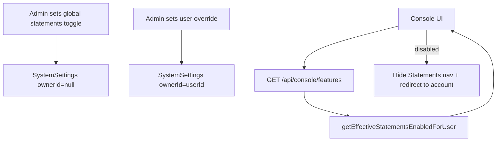
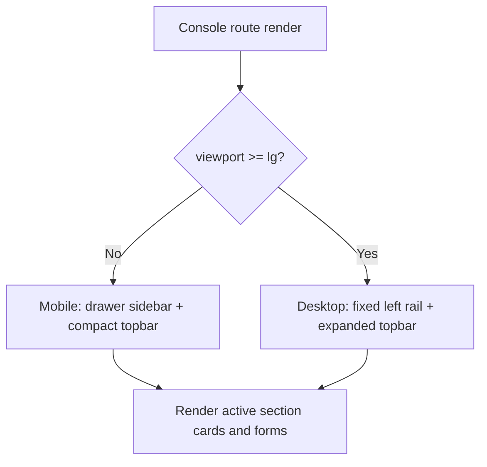

<!--
File: components/console/MODULE_DOC.md
Module: console
Purpose: Document the Trading Console UI module (navigation, sections, feature gating).
Author: Cursor / BharatERP
Last-updated: 2026-02-03
Notes:
- This module is UI-focused and lives under Next.js `components/console/`.
-->

# Module: console

**Short:** End-user Trading Console (profile, account, statements, deposits, withdrawals, banks, security).

**Purpose:** Provide users a dedicated console for account operations and history. Includes feature gating for compliance/ops controls.

## Key Screens / Routes
- `app/(console)/console/page.tsx` — main console page and section router

## Sections
- `ProfileSection` — profile editing
- `AccountSection` — balance / account summary
- `StatementsSection` — transactions history (feature gated)
- `DepositsSection` — add funds
- `WithdrawalsSection` — withdraw funds
- `BankAccountsSection` — bank management
- `SecuritySection` — security settings

## Feature gating: Statements

### Behavior
When statements are disabled, the console hides the **Statements** navigation item and prevents rendering the `StatementsSection`.

### Sources (effective resolution)
- Per-user override (tri-state): `SystemSettings(ownerId=<userId>, key=console_statements_enabled_override)`
  - `force_enable` / `force_disable`
- Global toggle: `SystemSettings(ownerId=null, key=console_statements_enabled_global)` (defaults to enabled if missing)

### Flow

## Responsive desktop shell behavior

### Summary
- Mobile keeps the drawer-based navigation and compact spacing.
- Desktop promotes a workspace shell with:
  - wider content canvas,
  - elevated topbar spacing,
  - section container surface for cleaner hierarchy.

### Responsive shell flow

## Files
- `components/console/console-layout.tsx` — layout + sidebar integration
- `components/console/sidebar-menu.tsx` — navigation menu (filters Statements when disabled)
- `components/console/sections/statements-section.tsx` — statements UI
- `lib/hooks/use-console-features.ts` — fetch feature availability
- `app/api/console/features/route.ts` — features endpoint
- `lib/server/console-statements.ts` — global + per-user resolution helper

## Changelog
- 2026-04-06 (IST): Profile avatar: `upload-avatar.ts`, `ProfileSection` add/change/remove; `topbar` uses `consoleData.user.image` fallback; `use-console-data` `updateAvatar` / `clearAvatar`; server `user-avatar-storage` + stricter `/api/upload` folders; JWT `token.picture` synced in `auth.ts`. Mirrored to `TradeBazaar`.
- 2026-04-01 (IST): Deposit proof uploads: KYC allowlist `/api/upload` + `/api/settings/payment`; `upload-deposit-proof.ts` + 4MB API/modals — mirrored from `TradeBazaar`.
- 2026-04-01 (IST): Deposits: Jest — `tests/trading/payment-deposit-validate-flow.test.ts`, `tests/api/console-post-deposit-flow.test.ts`, `tests/services/console-service-deposit-flow.test.ts` (mirrored from `TradeBazaar`).
- 2026-04-01 (IST): Deposits: unified success/error toasts with fallback copy when the API omits `message`; informational alert when `tradingAccount.id` is empty until wallet is provisioned. Hook-side JSON/error-body parsing in `use-console-data`. Mirrored from `TradeBazaar`.
- 2026-03-25 (IST): Statements table: wrapped descriptions, mobile card layout, transaction detail dialog with copy; statements mapping no longer uses `JSON.stringify` memo key; dev-only logging on `/console` and account section. Mirrored from `TradeBazaar`.
- 2026-02-03 (IST): Added app-wide + per-user tri-state gating for statements; console hides Statements nav and blocks statement export when disabled.
- 2026-02-16 (IST): Upgraded console desktop shell polish (wider max width, elevated section container surface, refined topbar sizing) while preserving mobile drawer behavior.
- 2026-02-16 (IST): Improved console loading and unauthenticated states with professional centered cards and desktop-friendly background hierarchy.
- 2026-02-16 (IST): Refined console loading and error state surfaces with richer desktop-friendly background treatment and expanded skeleton/error container sizing.
- 2026-02-16 (IST): Tuned extra-large desktop console spacing (`xl`) for better content breathing room on wide displays.
- 2026-02-16 (IST): Added IST time chip in desktop topbar for better real-time context on larger screens.
- 2026-02-16 (IST): Expanded key console modal widths on desktop (UPI payment, export, bank add/edit, change MPIN) for improved form readability.
- 2026-02-16 (IST): Increased console error-boundary fallback container width on desktop for better legibility.
- 2026-02-16 (IST): Added spinner and direct login CTA to console loading/unauthenticated route states for clearer recovery actions.
- 2026-02-16 (IST): Enhanced statements table desktop ergonomics with sticky header, framed scrollable surface, and improved description truncation behavior.
- 2026-02-16 (IST): Added desktop sticky-header framed scroll surfaces for deposit history, withdrawals list, and bank accounts table views.
- 2026-02-16 (IST): Added explicit file-level documentation headers to key console list/table components for maintainability and onboarding clarity.
- 2026-02-16 (IST): Synced console responsive workspace flow documentation in `docs/CONSOLE_FLOW_DIAGRAMS.md` with latest desktop shell behavior.
- 2026-02-16 (IST): Added explicit header docs on console route entry page to improve maintainability standards alignment.
- 2026-02-16 (IST): Synced `docs/CONSOLE_ARCHITECTURE.md` with latest desktop UX enhancements (shell, states, tables, dialogs).
- 2026-02-16 (IST): Added desktop section context strip in console layout (`title + description`) to strengthen hierarchy and orientation.
- 2026-02-16 (IST): Made desktop section context strip sticky at top of the console scroll canvas for persistent in-section orientation.
- 2026-02-16 (IST): Added active-section workspace chip in desktop topbar so current console area stays visible while scrolling.
- 2026-02-16 (IST): Added sidebar summary telemetry (visible section count + active section label) to strengthen desktop console navigation orientation.
- 2026-02-16 (IST): Added desktop context-strip telemetry badges for section index progression and statements feature-gate status.
- 2026-02-16 (IST): Enhanced topbar workspace chip with section progress (`current/total`) to mirror console section-order navigation context.
- 2026-02-16 (IST): Adopted shared `npm run test:desktop-ux` regression command for consistent console-surface validation in the desktop UX release cycle.
- 2026-02-16 (IST): Adopted expanded desktop quality scripts (`check:desktop-ux-cycles`, `check:duplicate-files`, `check:desktop-ux-quality:full`) for repeatable console quality auditing.
- 2026-02-16 (IST): Adopted strict duplicate-threshold quality scripts (`check:duplicate-files:strict`, `check:desktop-ux-quality:strict`) for baseline-guarded console release validation.
- 2026-02-16 (IST): Updated strict duplicate guard to baseline-file mode (`scripts/duplicate-file-baseline.txt`) for deterministic console quality gating.
- 2026-02-16 (IST): Extracted shared withdrawal/deposit type modules and removed a legacy duplicate `withdrawals-section` file to eliminate console-area circular dependencies (madge clean).
- 2026-02-16 (IST): Added standardized top-of-file headers to remaining console bank-account dialog and withdrawal-form components for maintainability consistency.
- 2026-02-16 (IST): Upgraded empty states in statements/deposits/withdrawals lists with framed, desktop-friendly messaging cards.
- 2026-02-16 (IST): Standardized file headers for core console shell components (`console-layout`, `topbar`, `sidebar-menu`).
- 2026-02-16 (IST): Standardized file headers for console state and resilience components (`console-loading-state`, `console-error-state`, `console-error-boundary`).
- 2026-02-16 (IST): Standardized file headers for all console workspace section components (`account`, `profile`, `deposits`, `withdrawals`, `banks`, `statements`, `security`).
- 2026-02-16 (IST): Hid mobile floating quick-actions FAB on desktop (`lg`) to reduce visual clutter in account workspace.
- 2026-02-16 (IST): Referenced consolidated desktop UX release note doc (`docs/DESKTOP_UX_UPGRADE_2026-02-16.md`) for cross-module validation traceability.
- 2026-02-16 (IST): Adopted duplicate-baseline maintenance command (`check:duplicate-files:refresh-baseline`) to support approved duplicate-set refresh workflows during console release governance.
- 2026-02-16 (IST): Synced console module QA governance evidence with post-governance strict rerun outcomes (10/29 tests, 0 cycles, baseline-aligned duplicates).
- 2026-02-23 (IST): Replaced console topbar mock bell with shared live `NotificationBell` and added a branding-route-based `Back to Dashboard` header action.

