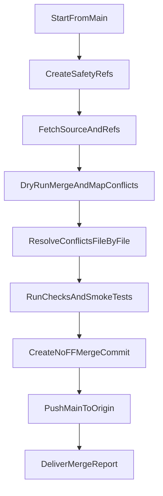

# Full Branch Safe Merge Plan

## Confirmed inputs

- Source branch: `origin/cursor/system-robustness-and-experience-13f9`
- Merge style: merge commit with `--no-ff`
- Post-merge action: push to `origin/main`
- Scope: full branch merge (all changes)

## Current findings

- Local branch is `main`, currently clean, and ahead of `origin/main` by 3 commits.
- Remote source branch exists, but is not fetched locally yet.
- Branch comparison shows heavy divergence (`ahead_by: 372`, `behind_by: 15`), which implies high conflict risk across many files.
- Likely conflict-heavy zones include admin/API and KYC paths such as:
  - [/home/amansharma/Desktop/DevOPS/Trading/tradingpro-platform/components/admin-console/kyc-queue.tsx](/home/amansharma/Desktop/DevOPS/Trading/tradingpro-platform/components/admin-console/kyc-queue.tsx)
  - [/home/amansharma/Desktop/DevOPS/Trading/tradingpro-platform/components/admin-console/MODULE_DOC.md](/home/amansharma/Desktop/DevOPS/Trading/tradingpro-platform/components/admin-console/MODULE_DOC.md)
  - [/home/amansharma/Desktop/DevOPS/Trading/tradingpro-platform/app/api/admin/kyc/route.ts](/home/amansharma/Desktop/DevOPS/Trading/tradingpro-platform/app/api/admin/kyc/route.ts)
  - [/home/amansharma/Desktop/DevOPS/Trading/tradingpro-platform/app/api/admin/alerts/route.ts](/home/amansharma/Desktop/DevOPS/Trading/tradingpro-platform/app/api/admin/alerts/route.ts)

## Execution approach

1. **Safety baseline and rollback points**
  - Re-verify clean worktree and synced refs.
  - Create safety backup refs for current `main` and source branch heads before merge work.
  - Create a dedicated temporary integration branch from current `main` for conflict resolution.
2. **Fetch and full diff mapping**
  - Fetch the exact source branch and refresh remote refs.
  - Generate branch-level diff inventory and conflict candidate list.
  - Group conflicts by domain (admin-console UI, API routes, shared utils, config/docs) to resolve systematically.
3. **Conflict resolution without functionality loss**
  - Perform `--no-ff` merge on integration branch and resolve conflicts file-by-file.
  - Never use blanket `ours/theirs`; reconcile both behaviors explicitly.
  - Preserve `main`’s recent KYC UX updates while porting missing robustness/system behavior from source branch.
  - For each edited module, keep docs aligned by updating relevant module docs/changelog entries where required.
4. **Robustness and regression validation gates**
  - Run type checks, lint, and test suites (targeted + broad).
  - Run dependency cycle checks (`madge`) and duplicate-file/unused-import scans per repo rules.
  - Validate high-risk user flows affected by this merge (admin console + KYC + system robustness paths).
5. **Finalize merge and publish**
  - Complete merge commit with a clear message documenting conflict resolution intent.
  - Push merged `main` to `origin/main`.
  - Provide you a merge report: conflict files resolved, decisions made, and validation results.

## Merge flow

