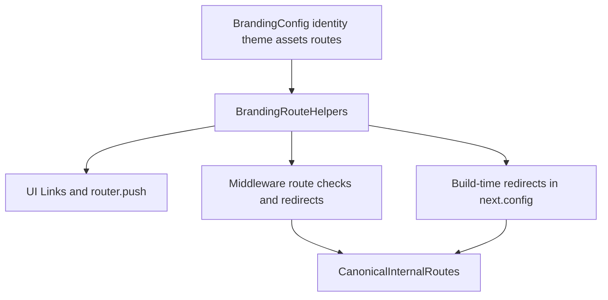

# Complete Branding + Slug Centralization Plan

## Goal

Ensure that changing `Branding/*` can rebrand the full UI, including configurable URL slugs for all UI surfaces (marketing, auth, dashboard, admin), while redirecting old URLs to new branded URLs.

## Confirmed Decisions

- Old URLs should **redirect to new branded URLs**.
- Slug configurability must cover **all UI surfaces** (marketing + auth + dashboard + admin).

## Implementation Strategy

Because Next.js App Router paths are filesystem-backed, we keep stable internal routes and make branded slugs configurable via helpers + redirect mapping.

## Work Plan

- **1) Expand branding route model to full UI coverage**
  - Update `[tradingpro-platform/Branding/identity.ts](tradingpro-platform/Branding/identity.ts)` to include full route keys for:
    - marketing (`whyUs`, `contact`, `affiliate`, `downloads`, `privacyPolicy`, `terms`, `products`, `paymentMethods`, etc.)
    - auth (`authRoot`, `login`, `register`, `forgotPassword`, `emailVerification`, `otp`, `kyc`, etc.)
    - dashboard/admin/console (`dashboard`, `admin`, `adminConsole`, `console`, admin children)
  - Add slug-driven builders (e.g., `brandSlug`) and legacy slug inputs for redirect compatibility.
  - Re-export via `[tradingpro-platform/Branding/index.ts](tradingpro-platform/Branding/index.ts)`.
- **2) Add unified route helper layer**
  - Create a new helper module (e.g., `[tradingpro-platform/lib/branding-routes.ts](tradingpro-platform/lib/branding-routes.ts)`) that provides:
    - typed route getters (`getRoute("dashboard")`, `getAuthRoute("login")`)
    - helpers for links with hash/query
    - old->new route mapping utilities used by middleware/redirect config
  - Keep all route-string construction centralized here.
- **3) Wire middleware + redirect infrastructure to branding routes**
  - Refactor `[tradingpro-platform/middleware.ts](tradingpro-platform/middleware.ts)` to:
    - consume route helpers instead of hardcoded arrays (`publicRoutes`, `authRoutes`, admin checks)
    - redirect legacy brand slugs and old route aliases to branded current routes
    - preserve query parameters on redirects
  - Add build-time redirect support in `[tradingpro-platform/next.config.mjs](tradingpro-platform/next.config.mjs)` for stable SEO-friendly migrations where possible.
- **4) Refactor all UI navigation to helper-based routes**
  - Replace hardcoded href/push strings with route helpers in key areas:
    - marketing: `[tradingpro-platform/components/marketing/marketpulse-home/marketpulse-header.tsx](tradingpro-platform/components/marketing/marketpulse-home/marketpulse-header.tsx)`, `[tradingpro-platform/components/marketing/marketpulse-home/marketpulse-footer.tsx](tradingpro-platform/components/marketing/marketpulse-home/marketpulse-footer.tsx)`, `[tradingpro-platform/lib/marketing/marketpulse-homepage-content.ts](tradingpro-platform/lib/marketing/marketpulse-homepage-content.ts)`, relevant `app/*` marketing pages
    - auth: `components/auth/*` and `app/(main)/auth/*`
    - dashboard/admin: `components/trading/*`, `components/admin-console/*`, `app/(admin)/*`, `components/Account.tsx`
  - Ensure all logos/text remain Branding-driven and all route links use route helpers.
- **5) Strengthen guardrails for future rebrands**
  - Extend `[tradingpro-platform/scripts/check-branding-literals.py](tradingpro-platform/scripts/check-branding-literals.py)` to also flag hardcoded legacy route-slug literals for covered UI route keys.
  - Keep `[tradingpro-platform/docs/BRANDING_PLAYBOOK.md](tradingpro-platform/docs/BRANDING_PLAYBOOK.md)` aligned with the route-helper workflow.
- **6) Validation + docs sync**
  - Run and verify:
    - `npm run check:branding`
    - `npm run check:desktop-ux-cycles`
    - `npm run type-check` (report pre-existing unrelated failures separately)
  - Update module changelogs for touched areas:
    - `[tradingpro-platform/components/MODULE_DOC.md](tradingpro-platform/components/MODULE_DOC.md)`
    - `[tradingpro-platform/lib/MODULE_DOC.md](tradingpro-platform/lib/MODULE_DOC.md)`
    - `[tradingpro-platform/scripts/MODULE_DOC.md](tradingpro-platform/scripts/MODULE_DOC.md)`

## Acceptance Criteria

- Editing only `Branding/*` (plus assets in `public/branding`) can change brand names, logos, theme, and configured UI slugs.
- All UI links/router navigation for marketing/auth/dashboard/admin resolve via route helpers.
- Old branded URLs redirect to current branded URLs across all UI surfaces.
- Branding literal and route-literal guard checks pass.

