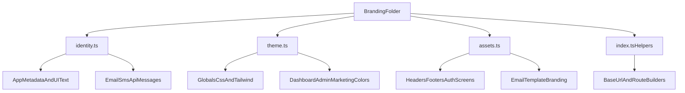

# Full Branding System Plan

## Goal

Create a **single-brand-config** architecture (as you selected) for `**tradingpro-platform` only**, using a small `Branding` folder so you can convert this software into a new branded product quickly.

## Current Findings (from code scan)

- Brand text is hardcoded across runtime UI + backend (examples):
  - `[tradingpro-platform/app/layout.tsx](tradingpro-platform/app/layout.tsx)`
  - `[tradingpro-platform/app/page.tsx](tradingpro-platform/app/page.tsx)`
  - `[tradingpro-platform/lib/ResendMail.ts](tradingpro-platform/lib/ResendMail.ts)`
  - `[tradingpro-platform/lib/aws-sns.ts](tradingpro-platform/lib/aws-sns.ts)`
- Visual branding is split between CSS vars + many hardcoded classes/colors:
  - `[tradingpro-platform/app/globals.css](tradingpro-platform/app/globals.css)`
  - `[tradingpro-platform/tailwind.config.ts](tradingpro-platform/tailwind.config.ts)`
  - many `blue/cyan/purple` classes in `components/*`, including admin/dashboard.
- Logo/assets are mixed (external URLs + local icons):
  - `[tradingpro-platform/components/auth/AuthHeader.tsx](tradingpro-platform/components/auth/AuthHeader.tsx)`
  - `[tradingpro-platform/public/marketpulse/icons/*](tradingpro-platform/public/marketpulse/icons/)`

```13:16:tradingpro-platform/app/layout.tsx
export const metadata: Metadata = {
  title: "MarketPulse360",
  description: "Just Rock And Trade Buddy!",
};
```

```38:43:tradingpro-platform/lib/ResendMail.ts
export const sendVerificationEmail = async (email: string, token: string) => {
    const confirmLink = `https://marketpulse360.live/auth/email-verification?token=${token}`

    await resend.emails.send({
        from: "onboarding@marketpulse360.live",
```

## Proposed `Branding` Folder (few files max)

Create exactly 4 core files in `[tradingpro-platform/Branding/](tradingpro-platform/Branding/)`:

- `[tradingpro-platform/Branding/identity.ts](tradingpro-platform/Branding/identity.ts)`
  - app names, company/legal strings, support/from emails, domain/base URLs, SMS sender label, route labels, default metadata.
- `[tradingpro-platform/Branding/theme.ts](tradingpro-platform/Branding/theme.ts)`
  - semantic color tokens, gradients, chart palette, watchlist palette, light/dark CSS var maps.
- `[tradingpro-platform/Branding/assets.ts](tradingpro-platform/Branding/assets.ts)`
  - logo paths, icon set paths, favicon path, email-logo path.
- `[tradingpro-platform/Branding/index.ts](tradingpro-platform/Branding/index.ts)`
  - re-exports + helpers like `getBaseUrl()`, `mailtoSupport()`, `buildAuthUrl()`.

## Migration Strategy (safe and complete)

1. **Foundation wiring first**
  - Wire metadata + global theme entrypoints to Branding constants in:
    - `[tradingpro-platform/app/layout.tsx](tradingpro-platform/app/layout.tsx)`
    - `[tradingpro-platform/app/globals.css](tradingpro-platform/app/globals.css)`
    - `[tradingpro-platform/tailwind.config.ts](tradingpro-platform/tailwind.config.ts)`
  - Keep existing UI behavior unchanged while replacing literal brand values with semantic tokens.
2. **Runtime-critical backend branding**
  - Replace hardcoded brand/domain/email strings in:
    - `[tradingpro-platform/lib/ResendMail.ts](tradingpro-platform/lib/ResendMail.ts)`
    - `[tradingpro-platform/lib/aws-sns.ts](tradingpro-platform/lib/aws-sns.ts)`
    - URL fallbacks in service layers (`lib/services/*`, `lib/server/*`, and API actions) to use Branding URL helpers.
3. **UI-wide text/logo branding pass (marketing + auth + dashboard + admin)**
  - Marketing already partly modularized; switch components/pages to Branding constants.
  - Auth/dashboard/admin components use `Branding.identity` + `Branding.assets` (no hardcoded app name/email/logo URLs).
  - Normalize any brand-slugged route labels in UI text (keep route paths stable unless explicitly changed later).
4. **Color system consolidation for full software**
  - Introduce semantic class/tokens (`brandPrimary`, `brandAccent`, `brandGradientPrimary`, etc.) and migrate hardcoded `blue/cyan/purple` hotspots in:
    - dashboard components
    - admin-console components
    - watchlist/position modules
    - maintenance and auth surfaces
  - Ensure watchlist default color sources come from Branding constants (app-level defaults + seed alignment).
5. **Branding guardrails (to keep future rebrands easy)**
  - Add a lightweight checker test/script to fail CI when old literals appear outside `Branding/` (e.g., `MarketPulse360`, `marketpulse360.live`).
  - Add a short rebrand playbook in docs describing “change these 4 files, run checks, done.”

## Architecture View




## Validation

- No direct legacy brand literals outside `Branding/` runtime files.
- Marketing/auth/dashboard/admin all render current brand values from Branding constants.
- Email/SMS templates and support links reflect Branding constants.
- Color and logo swap works by editing only `Branding/*` + asset files.
- Existing tests pass, plus branding-literal guard check passes.

