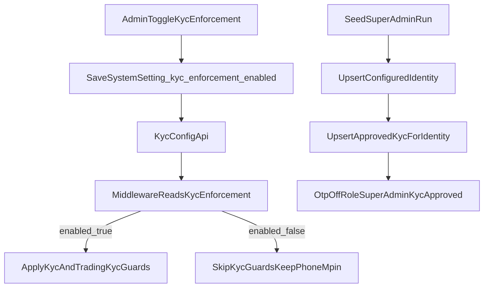

# KYC Bypass Toggle + Super Admin Seed Hardening

## Confirmed Behavior

- KYC bypass should skip **KYC checks including trading KYC blocks**.
- **Phone verification + mPin checks remain active**.
- Seed rerun should update **only configured seed identity** (email/clientId from script), not all `SUPER_ADMIN` users.

## Scope Files

- Settings UI/API: [components/admin-console/settings.tsx](components/admin-console/settings.tsx), [app/api/admin/settings/route.ts](app/api/admin/settings/route.ts)
- KYC enforcement config: new [lib/server/kyc-enforcement.ts](lib/server/kyc-enforcement.ts), new [lib/kyc-enforcement.ts](lib/kyc-enforcement.ts), new [app/api/kyc/config/route.ts](app/api/kyc/config/route.ts)
- Auth and route gating: [middleware.ts](middleware.ts), [actions/auth.actions.ts](actions/auth.actions.ts), [actions/mobile-auth.actions.ts](actions/mobile-auth.actions.ts)
- Super-admin bootstrap: [scripts/seed-super-admin.ts](scripts/seed-super-admin.ts), [prisma/schema.prisma](prisma/schema.prisma)
- Tests/docs: new tests under `tests/lib/*` and changelog updates in [components/admin-console/MODULE_DOC.md](components/admin-console/MODULE_DOC.md), [lib/MODULE_DOC.md](lib/MODULE_DOC.md), [scripts/MODULE_DOC.md](scripts/MODULE_DOC.md)

## Implementation Plan

### 1) Add KYC bypass option in app settings

- Extend [components/admin-console/settings.tsx](components/admin-console/settings.tsx):
  - Add state for `kycEnforcementEnabled` (default `true`).
  - Read key `kyc_enforcement_enabled` from `/api/admin/settings`.
  - Add a new switch in **General Settings** with clear warning text.
  - Persist via existing `POST /api/admin/settings` with category `KYC`.

### 2) Add robust KYC-enforcement config resolution

- Create server helper [lib/server/kyc-enforcement.ts](lib/server/kyc-enforcement.ts):
  - Read `SystemSettings` key `kyc_enforcement_enabled` (`ownerId: null`, active setting).
  - Add short cache TTL and safe fallback (`true`) on DB errors.
- Create edge/runtime helper [lib/kyc-enforcement.ts](lib/kyc-enforcement.ts):
  - Expose `isKycEnforcementEnabled()` for middleware use.
  - Use cached fetch to new config endpoint; fallback to `true` if unavailable.
- Add endpoint [app/api/kyc/config/route.ts](app/api/kyc/config/route.ts):
  - Return `{ enabled: boolean }` from server helper.
  - Runtime nodejs; no auth required (returns only non-sensitive boolean).

### 3) Apply toggle to auth and middleware checks

- Update [middleware.ts](middleware.ts):
  - Compute `kycEnforcementEnabled` once per request.
  - Gate all KYC-specific redirects/403 checks behind `kycEnforcementEnabled`.
  - Keep phone verification and mPin checks unchanged.
  - Keep admin-role bypass behavior unchanged.
- Update [actions/auth.actions.ts](actions/auth.actions.ts) and [actions/mobile-auth.actions.ts](actions/mobile-auth.actions.ts):
  - Skip KYC redirect responses when KYC enforcement is disabled.
  - Preserve existing phone/mPin and session safety checks.

### 4) Harden super-admin seed script for reruns

- Update [scripts/seed-super-admin.ts](scripts/seed-super-admin.ts):
  - In create + update payloads enforce:
    - `role: SUPER_ADMIN`
    - `requireOtpOnLogin: false`
    - `isActive: true`
    - `emailVerified: new Date()`
  - After user upsert, perform idempotent KYC upsert for the same resolved user:
    - `status: APPROVED`
    - set `approvedAt`
    - ensure required KYC fields are non-empty placeholders
    - keep `bankProofKey` compatible with current schema (nullable)
- Ensure no updates are applied to unrelated super-admin accounts.

### 5) Validation and docs

- Add/adjust targeted unit tests:
  - KYC enforcement helper parsing/fallback behavior.
  - Seed script helper logic for identity resolution + idempotent upsert branches.
- Run verification commands (targeted tests, type/lint checks where available).
- Update module changelogs in touched docs.

## Runtime Flow

