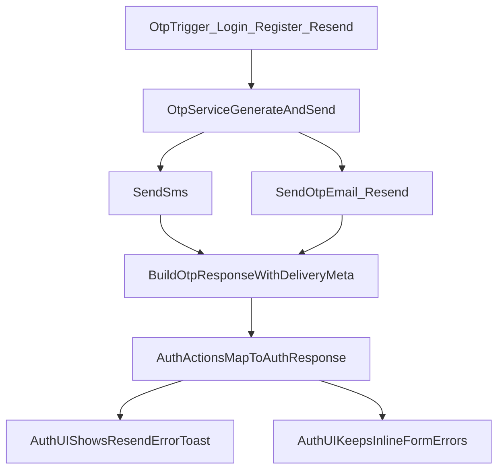

# OTP Email Delivery + Resend Error Visibility

## Findings From Code Audit

- OTP email is attempted in `[/home/amansharma/Desktop/DevOPS/Trading/TradeBazaar/lib/otp-service.ts](/home/amansharma/Desktop/DevOPS/Trading/TradeBazaar/lib/otp-service.ts)`, but `emailEnqueued` is set optimistically and Resend failures are not propagated reliably.
- Multiple auth action branches in `[/home/amansharma/Desktop/DevOPS/Trading/TradeBazaar/actions/mobile-auth.actions.ts](/home/amansharma/Desktop/DevOPS/Trading/TradeBazaar/actions/mobile-auth.actions.ts)` return generic OTP errors, which hides Resend-specific failures.
- Password reset OTP email fallback in `[/home/amansharma/Desktop/DevOPS/Trading/TradeBazaar/actions/auth.actions.ts](/home/amansharma/Desktop/DevOPS/Trading/TradeBazaar/actions/auth.actions.ts)` does not currently return Resend error details to the UI.
- Mobile auth screens (login/register/OTP/mPin) and forgot-password page currently render inline `FormError` only; they do not trigger toast notifications for provider-level email failures.

## Implementation Plan

### 1) Make OTP dispatch metadata accurate at source

- Update `[/home/amansharma/Desktop/DevOPS/Trading/TradeBazaar/lib/otp-service.ts](/home/amansharma/Desktop/DevOPS/Trading/TradeBazaar/lib/otp-service.ts)`:
  - Replace optimistic `emailEnqueued` with actual result-driven fields.
  - Ensure OTP flows always attempt email when `user.email` exists.
  - Return structured delivery metadata in `data` (e.g., `emailAttempted`, `emailEnqueued`, `emailError`).
  - Keep OTP success behavior intact even when email fails, but include explicit warning metadata.

### 2) Propagate Resend failures through action/API responses

- Update `[/home/amansharma/Desktop/DevOPS/Trading/TradeBazaar/actions/mobile-auth.actions.ts](/home/amansharma/Desktop/DevOPS/Trading/TradeBazaar/actions/mobile-auth.actions.ts)`:
  - Extend `AuthResponse`/`userData` contract to carry email delivery warning details.
  - For OTP flows (`mobileLogin`, `registerWithMobile`, `resendOtp`, `requestMpinResetOtp`), stop collapsing errors into generic messages; pass actionable OTP/email failure text.
- Update `[/home/amansharma/Desktop/DevOPS/Trading/TradeBazaar/actions/auth.actions.ts](/home/amansharma/Desktop/DevOPS/Trading/TradeBazaar/actions/auth.actions.ts)`:
  - In password-reset OTP backup-email path, capture `sendOtpEmail()` result and propagate Resend failure text in response metadata.
- Update `[/home/amansharma/Desktop/DevOPS/Trading/TradeBazaar/app/api/otp/send/route.ts](/home/amansharma/Desktop/DevOPS/Trading/TradeBazaar/app/api/otp/send/route.ts)`:
  - Return email warning fields so API consumers can display exact provider errors.

### 3) Show Resend errors in toast while keeping inline form errors

- Update auth UI components to consume new warning fields and trigger `toast({ variant: "destructive" ... })` for email-delivery failures:
  - `[/home/amansharma/Desktop/DevOPS/Trading/TradeBazaar/components/auth/MobileLoginForm.tsx](/home/amansharma/Desktop/DevOPS/Trading/TradeBazaar/components/auth/MobileLoginForm.tsx)`
  - `[/home/amansharma/Desktop/DevOPS/Trading/TradeBazaar/components/auth/MobileRegistrationForm.tsx](/home/amansharma/Desktop/DevOPS/Trading/TradeBazaar/components/auth/MobileRegistrationForm.tsx)`
  - `[/home/amansharma/Desktop/DevOPS/Trading/TradeBazaar/components/auth/OtpVerificationForm.tsx](/home/amansharma/Desktop/DevOPS/Trading/TradeBazaar/components/auth/OtpVerificationForm.tsx)`
  - `[/home/amansharma/Desktop/DevOPS/Trading/TradeBazaar/components/auth/MpinForm.tsx](/home/amansharma/Desktop/DevOPS/Trading/TradeBazaar/components/auth/MpinForm.tsx)`
  - `[/home/amansharma/Desktop/DevOPS/Trading/TradeBazaar/app/(main)/auth/forgot-password/page.tsx](/home/amansharma/Desktop/DevOPS/Trading/TradeBazaar/app/(main)`/auth/forgot-password/page.tsx)
- Keep existing inline `FormError` for field/action failures; add toast specifically for Resend/email-provider failures to satisfy UX requirement.

### 4) Add targeted verification tests

- Add focused tests for OTP email warning propagation and fallback behavior:
  - `tests/lib/otp-service-email-delivery.test.ts` (or extend existing OTP test coverage)
  - `tests/actions/mobile-auth-otp-error-propagation.test.ts` (or equivalent targeted action tests)
- Validate key cases:
  - SMS success + email failure => auth continues + warning returned
  - Rate-limited resend => specific message preserved
  - Password-reset OTP email failure => surfaced warning message

### 5) Module-doc sync

- Update changelog entries in:
  - `[/home/amansharma/Desktop/DevOPS/Trading/TradeBazaar/lib/MODULE_DOC.md](/home/amansharma/Desktop/DevOPS/Trading/TradeBazaar/lib/MODULE_DOC.md)`
  - `[/home/amansharma/Desktop/DevOPS/Trading/TradeBazaar/components/MODULE_DOC.md](/home/amansharma/Desktop/DevOPS/Trading/TradeBazaar/components/MODULE_DOC.md)`
- Mention new OTP-email warning propagation and toast behavior for Resend failures.

## Runtime Flow

