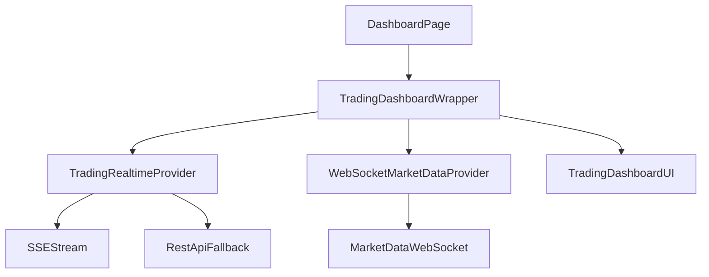

# 🏗️ Trading System Architecture

## Overview

This document describes the complete architecture of our **database-agnostic trading system** built with Next.js, Prisma, and TypeScript.

## 🎯 Design Principles

1. **Database Portability**: All logic in TypeScript, can work with any database supported by Prisma
2. **Atomic Operations**: All transactions use Prisma transactions for consistency
3. **Comprehensive Logging**: Every action logged with full context
4. **Type Safety**: Full TypeScript support throughout
5. **Testability**: Each service is independently testable
6. **Scalability**: Modular design allows easy feature additions

---

## 📊 System Architecture

```
┌─────────────────────────────────────────────────────────────────┐
│                         FRONTEND LAYER                           │
│  ┌─────────────┐  ┌──────────────┐  ┌────────────────────┐     │
│  │ OrderDialog │  │ PositionCard │  │ TradingDashboard │     │
│  └─────────────┘  └──────────────┘  └────────────────────┘     │
└────────────────────────┬────────────────────────────────────────┘
                         │ HTTP/REST API
                         ▼
┌─────────────────────────────────────────────────────────────────┐
│                         API ROUTES LAYER                         │
│  ┌──────────────────┐  ┌───────────────────┐                   │
│  │ /api/trading/    │  │ /api/trading/     │                   │
│  │   orders         │  │   positions       │                   │
│  └──────────────────┘  └───────────────────┘                   │
└────────────────────────┬────────────────────────────────────────┘
                         │
                         ▼
┌─────────────────────────────────────────────────────────────────┐
│                       SERVICE LAYER                              │
│  ┌──────────────────────┐  ┌────────────────────────────┐      │
│  │ OrderExecution       │  │ PositionManagement         │      │
│  │ Service              │  │ Service                    │      │
│  └──────────────────────┘  └────────────────────────────┘      │
│                                                                   │
│  ┌──────────────────────┐  ┌────────────────────────────┐      │
│  │ FundManagement       │  │ MarginCalculator           │      │
│  │ Service              │  │                            │      │
│  └──────────────────────┘  └────────────────────────────┘      │
│                                                                   │
│  ┌──────────────────────┐                                        │
│  │ TradingLogger        │                                        │
│  └──────────────────────┘                                        │
└────────────────────────┬────────────────────────────────────────┘
                         │
                         ▼
┌─────────────────────────────────────────────────────────────────┐
│                     REPOSITORY LAYER                             │
│  ┌──────────┐  ┌──────────┐  ┌──────────────┐  ┌────────────┐ │
│  │  Order   │  │ Position │  │ TradingAcct  │  │Transaction │ │
│  │  Repo    │  │  Repo    │  │    Repo      │  │   Repo     │ │
│  └──────────┘  └──────────┘  └──────────────┘  └────────────┘ │
└────────────────────────┬────────────────────────────────────────┘
                         │ Prisma ORM
                         ▼
┌─────────────────────────────────────────────────────────────────┐
│                     DATABASE (PostgreSQL)                        │
│  ┌─────────┐  ┌─────────┐  ┌──────────────┐  ┌──────────────┐ │
│  │ orders  │  │positions│  │trading_accts │  │transactions  │ │
│  └─────────┘  └─────────┘  └──────────────┘  └──────────────┘ │
│                                                                   │
│  ┌─────────┐  ┌─────────┐  ┌──────────────┐                    │
│  │  stock  │  │  logs   │  │ risk_config  │                    │
│  └─────────┘  └─────────┘  └──────────────┘                    │
└─────────────────────────────────────────────────────────────────┘
```

---

## 🧭 Dashboard Realtime Architecture (2026 Update)

The `/dashboard` trading UI is driven by **two realtime channels**:

- **Trading data** (orders/positions/account): SSE events + SWR fallback polling (visibility-aware, backoff + jitter).
- **Market data** (quotes/LTP): WebSocket market data provider with token subscriptions (index + watchlist + positions).

Key notes:
- We use `TradingRealtimeProvider` (client) as the single source of truth for trading data.
- The market-data provider derives position tokens from `TradingRealtimeProvider` to avoid duplicate position fetching.
- External TradingView script widgets have been removed; the Home tab uses internal widgets (`lightweight-charts` based chart).



## 🔄 Order Execution Flow

### **Complete Flow (worker-driven async execution)**

```
┌──────────────┐
│ User clicks  │
│  "BUY/SELL"  │
└──────┬───────┘
       │
       ▼
┌──────────────────────────────────────────────────────────────┐
│ Step 1: ORDER VALIDATION                                      │
│ ✓ Validate quantity > 0                                       │
│ ✓ Validate LIMIT orders have price                           │
│ ✓ Validate trading account exists                            │
└──────┬───────────────────────────────────────────────────────┘
       │
       ▼
┌──────────────────────────────────────────────────────────────┐
│ Step 2: RESOLVE EXECUTION PRICE                               │
│ • LIMIT order → use specified price                          │
│ • MARKET order → fetch LTP from quotes API                   │
└──────┬───────────────────────────────────────────────────────┘
       │
       ▼
┌──────────────────────────────────────────────────────────────┐
│ Step 3: CALCULATE MARGIN & CHARGES                            │
│ • Turnover = quantity × price                                │
│ • Get risk config from database                              │
│ • Calculate leverage (NSE MIS: 200x, CNC: 50x, NFO: 100x)   │
│ • Required margin = turnover / leverage                      │
│ • Calculate brokerage (0.03% or ₹20, whichever lower)       │
│ • Calculate STT, transaction charges, GST, stamp duty        │
│ • Total required = margin + charges                          │
└──────┬───────────────────────────────────────────────────────┘
       │
       ▼
┌──────────────────────────────────────────────────────────────┐
│ Step 4: VALIDATE SUFFICIENT FUNDS                             │
│ • Check availableMargin >= totalRequired                     │
│ • If insufficient → throw error with details                 │
└──────┬───────────────────────────────────────────────────────┘
       │
       ▼
┌──────────────────────────────────────────────────────────────┐
│ Step 5: ATOMIC TRANSACTION (Prisma Transaction)               │
│ ┌──────────────────────────────────────────────────────────┐ │
│ │ 5.1: Block Margin                                         │ │
│ │     • availableMargin -= requiredMargin                  │ │
│ │     • usedMargin += requiredMargin                       │ │
│ │     • Create DEBIT transaction record                    │ │
│ └──────────────────────────────────────────────────────────┘ │
│ ┌──────────────────────────────────────────────────────────┐ │
│ │ 5.2: Deduct Charges                                       │ │
│ │     • balance -= totalCharges                            │ │
│ │     • availableMargin -= totalCharges                    │ │
│ │     • Create DEBIT transaction record                    │ │
│ └──────────────────────────────────────────────────────────┘ │
│ ┌──────────────────────────────────────────────────────────┐ │
│ │ 5.3: Create Order                                         │ │
│ │     • Insert order with status = PENDING                 │ │
│ │     • Log ORDER_PLACED event                             │ │
│ └──────────────────────────────────────────────────────────┘ │
└──────┬───────────────────────────────────────────────────────┘
       │
       ▼
┌──────────────────────────────────────────────────────────────┐
│ Step 6: SCHEDULE EXECUTION (background worker)                │
│ • Persist order as PENDING                                   │
│ • Trigger best-effort execution via background enqueue       │
│ • Cron/worker backstops pick up pending orders safely        │
│ • User gets orderId immediately                              │
└──────┬───────────────────────────────────────────────────────┘
       │
       ▼
┌──────────────────────────────────────────────────────────────┐
│ Step 7: ORDER EXECUTION (worker + advisory lock)              │
│ ┌──────────────────────────────────────────────────────────┐ │
│ │ 7.1: Calculate Signed Quantity                           │ │
│ │     • BUY → +quantity                                    │ │
│ │     • SELL → -quantity                                   │ │
│ └──────────────────────────────────────────────────────────┘ │
│ ┌──────────────────────────────────────────────────────────┐ │
│ │ 7.2: Upsert Position                                      │ │
│ │     • If position exists:                                │ │
│ │       - Update quantity (avg if same direction)          │ │
│ │       - Close if opposite direction reduces to 0         │ │
│ │     • If new position:                                   │ │
│ │       - Create with initial quantity & price             │ │
│ └──────────────────────────────────────────────────────────┘ │
│ ┌──────────────────────────────────────────────────────────┐ │
│ │ 7.3: Mark Order as EXECUTED                               │ │
│ │     • status = EXECUTED                                  │ │
│ │     • filledQuantity = quantity                          │ │
│ │     • averagePrice = executionPrice                      │ │
│ │     • executedAt = now()                                 │ │
│ └──────────────────────────────────────────────────────────┘ │
│ ┌──────────────────────────────────────────────────────────┐ │
│ │ 7.4: Log Everything                                       │ │
│ │     • Log ORDER_EXECUTED                                 │ │
│ │     • Log POSITION_UPDATED                               │ │
│ └──────────────────────────────────────────────────────────┘ │
└──────┬───────────────────────────────────────────────────────┘
       │
       ▼
┌──────────────┐
│ ✅ COMPLETE  │
│ Order shown  │
│ as EXECUTED  │
│ Position     │
│ updated      │
└──────────────┘
```

---

## 🧱 2026-02-15 Hardening Updates

- Trading mutation endpoints now enforce ownership checks against the authenticated session user:
  - `/api/trading/orders` (POST/PATCH/DELETE)
  - `/api/trading/positions` (POST/PATCH)
  - `/api/trading/funds` (POST)
- Position close settlement runs in a single transaction boundary:
  - exit order creation
  - position close
  - margin release
  - realized P&L settlement (credit/debit)
- Watchlist/risk quote resolution is token-first with safe instrument fallback to avoid key mismatches.
- Position PnL worker and risk monitoring cron now include overlap guards:
  - in-process `already_running` guard
  - global DB-backed lease lock guard (`reason=locked`)

## 🏁 Position Closing Flow

```
┌──────────────┐
│ User clicks  │
│    "CLOSE"   │
└──────┬───────┘
       │
       ▼
┌──────────────────────────────────────────────────────────────┐
│ Step 1: FETCH POSITION                                        │
│ • Get position by ID with Stock details                      │
│ • Validate position exists and quantity ≠ 0                  │
└──────┬───────────────────────────────────────────────────────┘
       │
       ▼
┌──────────────────────────────────────────────────────────────┐
│ Step 2: GET EXIT PRICE                                        │
│ • Fetch current LTP from quotes API                          │
│ • Fallback to stock.ltp if API fails                         │
└──────┬───────────────────────────────────────────────────────┘
       │
       ▼
┌──────────────────────────────────────────────────────────────┐
│ Step 3: CALCULATE P&L                                         │
│ • realizedPnL = (exitPrice - avgPrice) × quantity           │
│ • Calculate margin to release based on segment & product     │
└──────┬───────────────────────────────────────────────────────┘
       │
       ▼
┌──────────────────────────────────────────────────────────────┐
│ Step 4: ATOMIC TRANSACTION                                    │
│ ┌──────────────────────────────────────────────────────────┐ │
│ │ 4.1: Create Exit Order                                    │ │
│ │     • Opposite side (BUY→SELL, SELL→BUY)                │ │
│ │     • Mark as EXECUTED immediately                       │ │
│ └──────────────────────────────────────────────────────────┘ │
│ ┌──────────────────────────────────────────────────────────┐ │
│ │ 4.2: Close Position                                       │ │
│ │     • Set quantity = 0                                   │ │
│ │     • Store realizedPnL                                  │ │
│ │     • Clear stopLoss and target                          │ │
│ └──────────────────────────────────────────────────────────┘ │
│ ┌──────────────────────────────────────────────────────────┐ │
│ │ 4.3: Release Margin                                       │ │
│ │     • availableMargin += marginAmount                    │ │
│ │     • usedMargin -= marginAmount                         │ │
│ │     • Create CREDIT transaction                          │ │
│ └──────────────────────────────────────────────────────────┘ │
│ ┌──────────────────────────────────────────────────────────┐ │
│ │ 4.4: Apply P&L                                            │ │
│ │     • If profit: credit to balance                       │ │
│ │     • If loss: debit from balance                        │ │
│ │     • Create transaction record                          │ │
│ └──────────────────────────────────────────────────────────┘ │
└──────┬───────────────────────────────────────────────────────┘
       │
       ▼
┌──────────────┐
│ ✅ COMPLETE  │
│ Position     │
│ closed       │
│ P&L realized │
└──────────────┘
```

---

## 💰 Margin Calculation Logic

### **NSE Equity (Cash Market)**

| Product Type | Leverage | Margin Required | Use Case |
|-------------|----------|-----------------|----------|
| **MIS** (Intraday) | 200x | 0.5% of turnover | Day trading |
| **CNC** (Delivery) | 50x | 2% of turnover | Delivery trading |

**Example:**
- Stock: RELIANCE @ ₹2,500
- Quantity: 10 shares
- Turnover: 10 × ₹2,500 = ₹25,000

**MIS:**
- Margin = ₹25,000 / 200 = ₹125

**CNC:**
- Margin = ₹25,000 / 50 = ₹500

---

### **NFO (Futures & Options)**

| Instrument | Leverage | Margin Required |
|-----------|----------|-----------------|
| **Futures** | 100x | 1% of turnover |
| **Options** | 100x | 1% of turnover |

**Example:**
- NIFTY FUT @ 21,000
- Lot Size: 50
- Quantity: 1 lot (50 units)
- Turnover: 50 × ₹21,000 = ₹10,50,000

**Margin:**
- ₹10,50,000 / 100 = ₹10,500

---

### **Brokerage Calculation**

#### **NSE Equity:**
```
Brokerage = min(0.03% of turnover, ₹20 per order)
```

#### **NFO:**
```
Brokerage = ₹20 flat per order
```

#### **Other Charges:**
- **STT (Securities Transaction Tax)**:
  - Delivery: 0.1% on both sides
  - Intraday: 0.025% on sell side
- **Transaction Charges**: 0.00325% of turnover
- **GST**: 18% on (brokerage + transaction charges)
- **Stamp Duty**: 0.003% of turnover

---

## 📝 Logging System

All operations are logged to `trading_logs` table:

### **Log Categories:**
- `ORDER`: Order placement, execution, cancellation
- `POSITION`: Position creation, updates, closing
- `TRANSACTION`: Fund operations
- `FUNDS`: Margin operations
- `SYSTEM`: System events
- `API`: API calls

### **Log Levels:**
- `INFO`: Normal operations
- `WARN`: Warnings (e.g., low margin)
- `ERROR`: Errors and failures
- `DEBUG`: Debugging information

### **Log Details:**
Each log entry includes:
- Timestamp
- Client ID / User ID
- Action performed
- Details (JSON)
- Metadata (request ID, duration, etc.)
- Error message and stack trace (if error)

---

## 🔒 Transaction Safety

All critical operations use **Prisma Transactions**:

```typescript
await executeInTransaction(async (tx) => {
  // All operations here are atomic
  // If any operation fails, all are rolled back
  await blockMargin(tx)
  await deductCharges(tx)
  await createOrder(tx)
})
```

**Benefits:**
- ✅ Atomicity: All-or-nothing execution
- ✅ Consistency: Database always in valid state
- ✅ Isolation: Concurrent operations don't interfere
- ✅ Durability: Changes are permanent once committed

---

## 🗄️ Database Schema (Key Tables)

### **orders**
- Order details (symbol, quantity, price, type, side)
- Status tracking (PENDING, EXECUTED, CANCELLED)
- Timestamps (createdAt, executedAt)

### **positions**
- Current holdings (symbol, quantity, avgPrice)
- P&L tracking (unrealizedPnL, dayPnL)
- Risk management (stopLoss, target)

### **trading_accounts**
- Account balances
- Margin tracking (available, used)
- User relationship

### **transactions**
- All fund movements
- Type (CREDIT, DEBIT)
- Descriptions and amounts

### **risk_config**
- Configurable risk parameters
- Leverage ratios
- Brokerage rates
- Per segment and product type

### **trading_logs**
- Comprehensive audit trail
- All operations logged
- Full context and metadata

---

## 🚀 Key Features

### ✅ **Implemented**
- ✅ Order placement with validation
- ✅ 3-second execution simulation
- ✅ Position management
- ✅ Margin calculation (NSE, NFO)
- ✅ Fund management (block, release, debit, credit)
- ✅ Comprehensive logging
- ✅ Database-agnostic (Prisma ORM)
- ✅ Atomic transactions
- ✅ Error handling with retries
- ✅ Type-safe TypeScript

### 🔜 **Coming Soon** (See FEATURE_ROADMAP.md)
- Stop-loss and target triggers
- Real-time P&L updates
- Portfolio analytics
- Tax reports
- Risk alerts
- And many more!

---

## 📦 Project Structure

```
lib/
├── services/              # Business logic layer
│   ├── order/
│   │   └── OrderExecutionService.ts
│   ├── position/
│   │   └── PositionManagementService.ts
│   ├── funds/
│   │   └── FundManagementService.ts
│   ├── risk/
│   │   └── MarginCalculator.ts
│   ├── logging/
│   │   └── TradingLogger.ts
│   └── utils/
│       └── prisma-transaction.ts
│
├── repositories/          # Data access layer
│   ├── OrderRepository.ts
│   ├── PositionRepository.ts
│   ├── TradingAccountRepository.ts
│   └── TransactionRepository.ts
│
└── server/               # Legacy (being migrated)
    └── validation.ts

app/api/trading/          # API routes
├── orders/
│   └── route.ts
└── positions/
    └── route.ts
```

---

## 🧪 Testing

Each service can be tested independently:

```typescript
// Example: Test order placement
const logger = createTradingLogger()
const orderService = createOrderExecutionService(logger)

const result = await orderService.placeOrder({
  tradingAccountId: 'test-account',
  stockId: 'stock-123',
  symbol: 'RELIANCE',
  quantity: 10,
  orderType: 'MARKET',
  orderSide: 'BUY',
  // ...
})
```

---

## 🔧 Configuration

### Environment Variables

```env
DATABASE_URL=postgresql://...
DIRECT_URL=postgresql://...
NEXT_PUBLIC_BASE_URL=http://localhost:3000
```

### Risk Configuration

Edit via database `risk_config` table:

```sql
INSERT INTO risk_config (segment, product_type, leverage, brokerage_flat)
VALUES ('NSE', 'MIS', 200, 20);
```

---

## 📈 Performance Considerations

1. **Database Indexes**: All queries use indexed columns
2. **Transaction Optimization**: Minimal operations in transactions
3. **Connection Pooling**: Prisma handles connection pooling
4. **Async Operations**: All I/O operations are async
5. **Error Handling**: Graceful degradation on failures

---

## 🔐 Security

1. **Input Validation**: All inputs validated with Zod
2. **Type Safety**: Full TypeScript coverage
3. **SQL Injection**: Protected by Prisma ORM
4. **Transaction Isolation**: Prevents race conditions
5. **Audit Logging**: All operations logged

---

## 📞 Support

For questions or issues, please check:
- System logs in `trading_logs` table
- Console output (all operations logged)
- Error messages (detailed context provided)

---

**Built with ❤️ for scalability, reliability, and database portability**