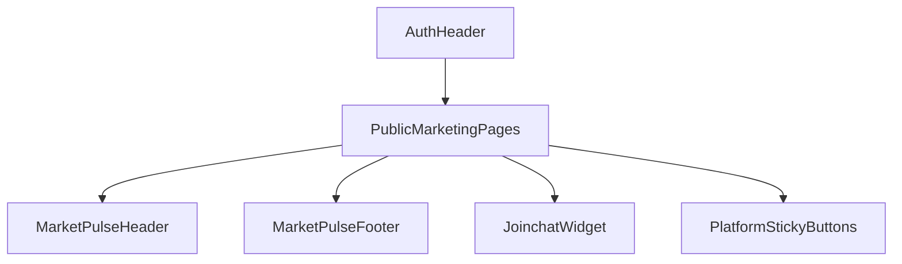

# Module: components

**Short:** Shared UI building blocks and cross-page component primitives.

**Purpose:** Host reusable presentational components used across auth, dashboard, and marketing surfaces.

**Key files for this change:**
- `auth/AuthHeader.tsx` - Auth flow branding header.
- `marketing/marketpulse-home/*` - MarketPulse marketing shell/header/footer/widgets for public pages.
- `marketing/marketpulse-home/MODULE_DOC.md` - Module-level docs for the new marketing component group.
- `pull-to-refresh/pull-to-refresh-provider.tsx` - Sitewide mobile pull-to-refresh gesture provider mounted from root layout.

**Branding flow:**

**Dependencies:**
- Internal: `next/image`, `next/link`, `components/ui/popover`, module-specific page components
- External: none

**Change-log:** (auto-updated by Cursor on edits)
- 2026-04-03: `maintenance/MaintenanceMode.tsx` uses GET `/api/maintenance/status` for live message/end time (DB-aligned) with env fallback.
- 2026-03-29: `WatchlistObsidianChartShell`: `data-vaul-no-drag` on timeframe row + chart region so Vaul left drawer does not close while panning/scrolling the chart or horizontally scrolling TF pills (mobile).
- 2026-03-29: Watchlist chart drawer (`WatchlistItemCard`) uses `WatchlistObsidianChartShell` — same Obsidian-style sym bar, TF row, and O/H/L/C overlay as home mobile chart; `InstrumentCandleChart` remains `layout="flex"`.
- 2026-03-28: Trading widgets — below `lg`, home chart uses `MobileTradingChartPanel` (Obsidian mobile: TF row, O/H/L/C strip, Sell/Buy → order dialog via `TradingHome` quick handlers); shared `trading-chart-timeframes.ts` + `resolveStockForHomeChartSymbol`. `lg+` uses `DesktopTradingChartPanel` (toolbar, OHLC+VOL, candle/line). `InstrumentCandleChart`: `terminal` layout, `chartType`, `onOhlcDisplay`.
- 2026-03-25: Watchlist `stock-search`: top-anchored Vaul sheet (`direction="top"`, ~`top-5` below safe-area) stretches `top`→`bottom-0` with `max-h-none` so results use full remaining viewport height; `flex-1` scroll region + safe-area bottom padding; `fixed` + search `scrollIntoView` on focus for mobile keyboard.
- 2026-03-20: Fixed desktop `/dashboard` workspace rail tab switching: raised aside stacking (`z-[35]` above main sticky priority rail) and on plain primary click use `router.replace` + optimistic tab state so `?tab=` updates reliably (left rail no longer loses clicks to overlapping sticky layers).
- 2026-03-19: Added `pull-to-refresh/pull-to-refresh-provider.tsx` and wired it at root layout for sitewide mobile pull-down refresh with threshold guards and status indicator states.
- 2026-03-05: Hardened Positions tab feed resilience for enterprise UX by freezing row MTM/LTP at last confirmed live values during snapshot/offline windows, adding per-row `LIVE/FROZEN/NO LIVE` trust badges with tooltips, and exposing positions feed/sync health strip with explicit resync action.
- 2026-02-27: Updated `position-tracking` ordering so active/open positions render first while closed positions are pushed below them (both within instrument groups and across groups) for a clearer trading workflow.
- 2026-02-27: 60s quote-consistency UX hardening: watchlist/positions/order header now share one strict display policy (`LIVE`/`SNAPSHOT`/`STALE`), stale >60s numeric prices render as `--`, and order/place + position/close flows now show subtle “Refreshing live price…” warm-up states before surfacing hard warnings.
- 2026-02-27: Dashboard smoothness UX pass: watchlist rows now mark any non-live quote source as snapshot/stale for clearer user feedback, order form now blocks MARKET submit only when recent quote is unavailable (<=60s) with explicit guidance, and position square-off now surfaces clearer stale-feed messaging plus snapshot-price notice when live ticks are delayed.
- 2026-02-26: Fixed dashboard-order dialog null-deref crash (`Cannot read properties of null (reading 'segment')`) by making `selectedStock` access null-safe (`selectedStock?.segment`) before the post-hook null guard.
- 2026-02-26: Fixed `OrderDialog` Rules-of-Hooks regression from watchlist open flow by moving `selectedStock` null-guard below all hook declarations, eliminating hook-order mismatch and HotReload render-update warnings on first dialog mount.
- 2026-02-26: Zerodha-style execution UX polish: dashboard index widgets now show `LIVE/SNAPSHOT/LAST CLOSE/NO LIVE` with last-quote retention (instead of aggressive `--` on sparse ticks), and orders tab now normalizes status badges (`PARTIALLY_FILLED`) with user-friendly failure reasons for stale/no-live/margin/session rejections.
- 2026-02-26: Sparse-tick market-data UX hardening: watchlist/positions/order header now show last received quote (only show `NO LIVE` when no quote ever received), order dialog blocks MARKET only when quote is older than 60s (not 5s), websocket disconnects retain last quotes, and watchlist click/remove/alert actions use robust ID fallbacks to prevent crashes.
- 2026-02-25: Exchange-aware live market-data wiring: UI subscription calls now use exchange-qualified keys when required, and token-scoped subscription failures are surfaced per-instrument (watchlist rows show `NO LIVE`) without flipping the global connection icon offline.
- 2026-02-25: Strict live-only UI: watchlist/order/position surfaces now hide stale numbers (render `--`) and clearly indicate `STALE/Live required`; order dialog actively subscribes the selected token and blocks MARKET until a fresh quote (<=5s) arrives; position square-off blocks when live quote is stale/offline.
- 2026-02-24: Unified client quote semantics across watchlist/order/header/dashboard: watchlist now uses shared quote snapshot resolver with explicit `SNAPSHOT` badge on stale/fallback prices, dashboard stream badge now distinguishes live/connecting/snapshot/offline states, and orders list now separates **Submitted** vs **Executed** prices to reduce perceived mismatch during async execution.
- 2026-02-24: Client quote gating & header sync: order panel allows MARKET submit with non-blocking stale warning and "Snapshot" label when quote is fallback; TradingDashboard index display is freshness-aware (Offline/Stale when disconnected or quote >5s); removed simulated index update loops in enhanced-header and clean-header (static placeholders only).
- 2026-02-24: Aligned order/watchlist UI with live-price integrity policy: `OrderHeader` now renders live quote stream values (not stale snapshot-only LTP), and watchlist cards now visibly flag instruments that cannot be live-subscribed (`NO LIVE`) so stale/static rows are surfaced to users.
- 2026-02-23: Simplified watchlist card action UX by removing the inline dollar order button from `components/watchlist/WatchlistItemCard.tsx`; card click now opens the order drawer directly while the chevron remains as the dedicated expand/collapse control.
- 2026-02-23: Hardened watchlist realtime behavior by treating stale quote snapshots as degraded data in `components/watchlist/WatchlistManager.tsx` (fallback to persisted watchlist price/close) while preserving existing smoothed live rendering for fresh quotes.
- 2026-02-22: Updated watchlist search add payload sanitization to omit null optional numeric fields (notably `strikePrice`) so valid equity adds no longer fail API input checks.
- 2026-02-22: Refined watchlist add UX by marking already-added search tokens in the add dialog and making post-add watchlist refresh non-blocking to avoid false failure toasts after successful inserts.
- 2026-02-22: Hardened watchlist add-from-search flow by removing synthetic `stockId` payload fallback, normalizing instrument metadata payloads, and enforcing stricter client-side identifier validation before add requests.
- 2026-02-22: Strengthened auth-to-dashboard finalization by adding timeout-bounded session polling, explicit credential-session retry, strict `session.user.id` readiness checks, and hard-navigation fallback to eliminate post-login loading deadlocks.
- 2026-02-21: Standardized dashboard PnL rendering with a shared hybrid-smart resolver so position rows, positions summary cards, and home/header totals all use consistent Day MTM vs Unrealized/Booked semantics (live quote preferred for smooth UI, server snapshot fallback/sync).
- 2026-02-21: Hardened auth-to-dashboard UX: mPin success now waits for confirmed NextAuth session bootstrap before navigation, shows explicit finalizing/retry UI, and dashboard wrapper now includes session-load timeout recovery to avoid manual-refresh deadlocks.
- 2026-02-21: Refined dashboard `position-tracking` cards to compact premium layout with higher data density (segment/expiry/strike/lots chips), tighter spacing, smoother micro-animations, and true dynamic SL/TP progress visualization.
- 2026-02-21: Updated positions SL/TP UX to apply positions-only cache refresh after set-stoploss/set-target actions (reduced full dashboard refresh churn for smoother client-side flow).
- 2026-02-20: Centralized all public marketing UI labels/copy (header/footer/home sections/page text) into `Branding/marketing.ts` and removed remaining brand-specific literals from marketing components/pages.
- 2026-02-20: Rebuilt `/` as a TradeBazaar-inspired composed marketing homepage (`marketpulse-homepage.tsx` + `marketpulse-sections.tsx`) with interconnected CTAs to products, payment methods, downloads, blog, contact, and auth routes.
- 2026-02-20: Replaced hardcoded navigation literals across marketing/auth/dashboard/admin-console components with `lib/branding-routes.ts` helpers (`getMarketingRoute`, `getAuthRoute`, `getAppRoute`, `getAdminConsoleRoute`) so Branding route templates fully drive UI slugs.
- 2026-02-20: Migrated auth/marketing/trading/maintenance UI branding references to `Branding/*` constants (names, support email, logo paths) and switched watchlist color presets/defaults to `BRAND_THEME.watchlist` for centralized re-skinning.
- 2026-02-19: Added MarketPulse marketing component module under `components/marketing/marketpulse-home` (header, footer, shell, banner, chat widget, and platform sticky buttons) to support TradeBazaar-inspired public pages while preserving the existing home hero.
- 2026-02-17: Home dashboard now consumes merged admin defaults + user overrides via `/api/market-data/home-config`, adds user personalization dialog for marquee/widget preferences, and introduces internal Top Movers + Market Stats widgets (no external TradingView embed/branding).
- 2026-02-17: Upgraded `position-tracking` exit UX with a dedicated exit dialog supporting complete exit plus partial exit by quantity or lots (for lot-based contracts), including live exit preview and robust client-side validation.
- 2026-02-17: Fixed watchlist empty-state create flow by mounting `CreateWatchlistDialog` when `watchlists.length === 0`, so fresh users can create their first watchlist.
- 2026-02-16: Updated shared/auth/marketing logo references to use new TradeBazaar assets under `public/tradebazaar/`.
- 2026-02-16: Renamed marketing runtime component module/symbols from legacy names to `tradebazaar-*` and updated auth/trading UI copy to TradeBazaar branding.
- 2026-02-16: Improved admin KYC component UX with clearer document-link recovery messaging for expired presigned URLs and missing bank-proof artifacts.
- 2026-02-16: Updated auth mobile OTP UX to preserve inline errors while showing provider-level OTP email delivery failures (`Resend`) in destructive toasts for login/registration/resend/reset paths.
