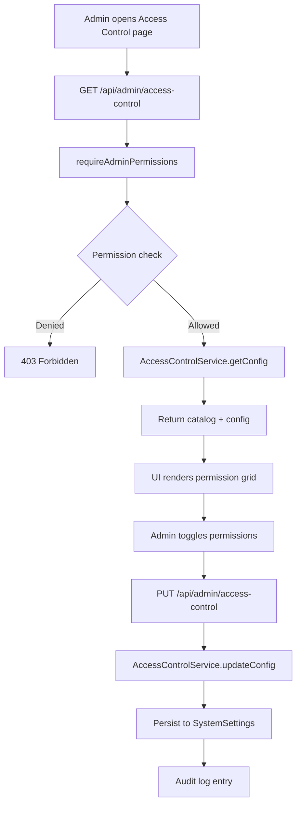
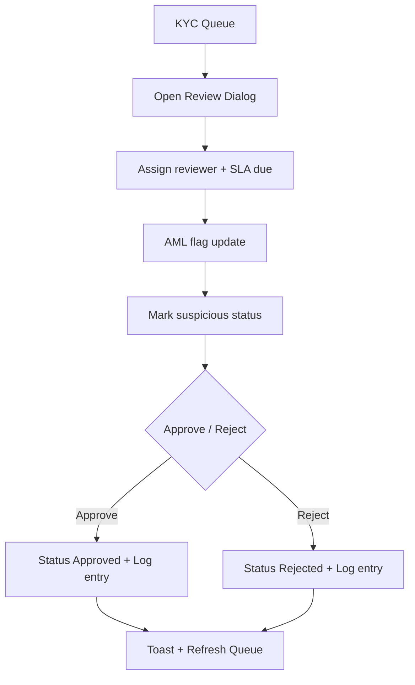
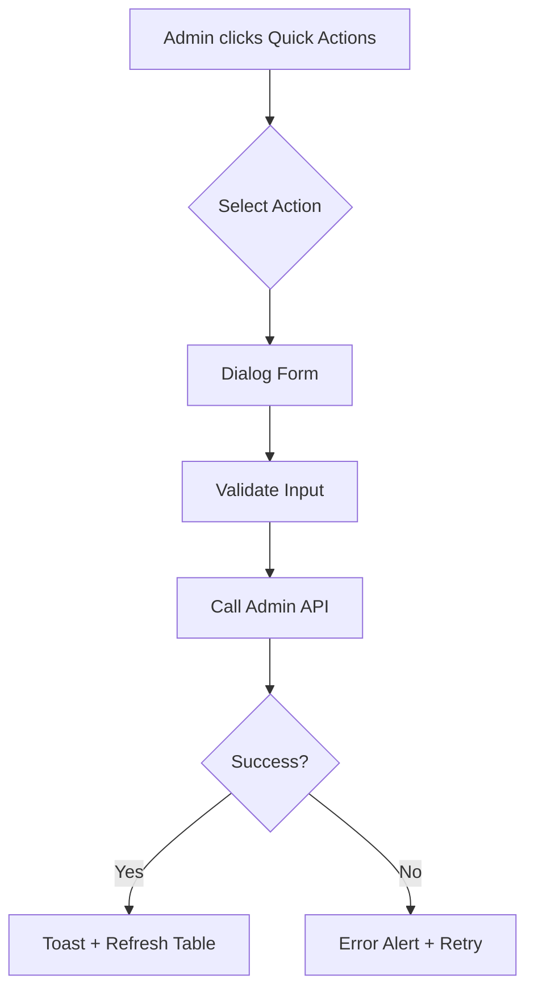

# Module: admin-console

**Short:** Admin console UI with access control management and operational workflows.

**Purpose:** Provide administrators a secure dashboard for operations, including RBAC management, user management, fund approvals, and risk monitoring. Focuses on fast operator workflows with robust error visibility.

## Key Screens
- **Dashboard:** Platform KPIs, alerts, and top traders.
- **User Management:** Search, filters, bulk actions, and per-user dialogs.
- **Fund Management:** Deposits and withdrawals review with approvals.
- **Risk Management:** Platform risk config, user limits, alerts, dynamic trading policies (guided **policy wizard**, template gallery, segment/product chip helpers, plain-language summaries on the grid), and the unified risk backstop (positions worker is canonical enforcer).
- **Access Control:** RBAC management UI.
- **KYC Queue:** Dedicated queue for KYC verification with SLA tracking.
- **Workers:** Background worker visibility (status/heartbeat), Redis realtime readiness, enable/disable, and run-once triggers (including risk backstop skip reasons).
- **Position Management:** Live admin position grid with server-side PnL mode verification, worker heartbeat visibility, and full/partial exit controls (quantity/lots, live vs DB LTP vs manual exit, optional net square-off across sibling lots via `/api/admin/positions/net-close`).
- **Cleanup Management:** Manual cleanup with worker-linked automation controls (IST run window + retention days + last auto-run telemetry).
- **Orders:** Order list; **Order charges** tab (`orders-management-order-charges-tab.tsx`) for `order_charges_config_v1`. Brokerage remains Settings → Brokerage.
- **System Health, Logs, Settings, Notifications, Financial Reports.**
- **Audit Trail:** Authentication events (`auth_events`) and platform/trading logs (`trading_logs`) with IST timestamps, summary metrics, drill-down JSON dialog, debounced search, and CSV export of the current page (`admin.audit.read`). Parity with tradingpro-platform implementation.

## User Quick Actions
Exposes existing admin APIs in the User Management table:
- Reset password: `POST /api/admin/users/{userId}/reset-password`
- Reset MPIN: `POST /api/admin/users/{userId}/reset-mpin`
- Freeze/unfreeze account: `POST /api/admin/users/{userId}/freeze`
- Verify contact (email/phone): `POST /api/admin/users/{userId}/verify-contact`
- Assign/unassign RM: `PATCH /api/admin/users/{userId}/assign-rm`
- Risk limits override: `GET/PUT /api/admin/users/{userId}/risk-limit`

## Data Source Clarity
- Live/Partial/Error/Sample statuses surfaced on Dashboard, User Management, and Fund Management.
- Sample data is manual-only and never auto-selected.
- Error alerts include reasons for each failing endpoint.

## KYC & Compliance Ops
- Dedicated queue: `GET /api/admin/kyc` → `/admin-console/kyc` (optional `relatedContactOverlap=1` / `true` — applicants whose user has normalized email/phone overlap; same MODERATOR book scope as user-list duplicate filter)
- Assignment & SLA tracking: `PATCH /api/admin/kyc`
- AML flags + suspicious review status (clear/review/escalated)
- Review logs stored in `kyc_review_logs`
- Document viewer for bank proof URL
- Filters include AML flag match and SLA buckets (24h/48h/72h)

## Files
- `header.tsx` — loads admin session, role, and permissions; theme via `ThemeToggle` (next-themes)
- `sidebar.tsx` — navigation gated by permissions
- `access-control.tsx` — RBAC management UI
- `risk-management.tsx` — risk limits/config + alerts + thresholds + dynamic policies + run-now backstop
- `risk-management/trading-policy-*.ts(x)` — extracted policy studio state, plain summaries, token field, template gallery, wizard dialog (**tradingpro-platform** and **TradeBazaar** parity)
- `workers.tsx` — worker cards (health, enable/disable, run once, config inputs)
- `positions-management.tsx` — live admin positions table, server-side PnL status, and robust close dialog (full/partial exits)
- `positions-management-pnl-display.ts` — pure helpers for open vs closed P&L display aligned with user list API
- `kyc-queue/` — modular KYC queue (root, toolbar, metrics, table, compliance dialog, **Applicant CRM drawer** with timeline + User Management deep link; no duplicate user-management pipeline)
- `app/(admin)/admin-console/kyc/page.tsx` — KYC queue entry
- `app/(admin)/admin-console/access-control/page.tsx` — access control page entry
- `app/(admin)/admin-console/workers/page.tsx` — workers page entry
- `app/api/admin/access-control/route.ts` — RBAC config API
- `app/api/admin/kyc/route.ts` — KYC queue + review actions API
- `app/api/admin/kyc/[kycId]/route.ts` — KYC detail + review logs API
- `app/api/admin/workers/route.ts` — worker status + manage API (no CRON secrets in browser)
- `app/api/admin/positions/route.ts` — list/manage/create positions with server-side PnL settings metadata
- `app/api/admin/risk/thresholds/route.ts` — read/update canonical risk thresholds (SystemSettings)
- `app/api/admin/risk/policies/route.ts` — dynamic admin trading policy CRUD + catalog (SystemSettings)
- `app/api/admin/risk/monitor/route.ts` — run risk backstop (skips if positions worker healthy unless force-run)
- `app/api/admin/cleanup/automation/route.ts` — read/update cleanup automation controls for worker-linked scheduled purge
- `lib/server/workers/registry.ts` — worker registry + health rules + SystemSettings keys
- `lib/admin/kyc-utils.ts` — SLA and AML flag utilities
- `lib/services/admin/AccessControlService.ts` — RBAC config persistence
- `audit-trail.tsx` — audit UI (auth vs trading tabs, filters, summary strip, detail dialog, export)
- `lib/services/admin/audit-trail.service.ts` — list auth events + trading logs, metadata IP/UA parsing, summary counts
- `lib/admin/audit-trail-filter-options.ts` — client-safe enum option lists for filters
- `app/api/admin/audit/route.ts` — `GET` audit listing + optional `summary`
- `app/(admin)/admin-console/audit/page.tsx` — audit page shell
- `lib/admin/synthetic-system-health-snapshot.ts` — deterministic observability-shaped synthetic payload (meta, correlation IDs, traffic percentiles, runtime, signals, dependencies, DB internals, service semver/ready/p99) for System Health; Prisma merge in route
- `MODULE_DOC.md` — this file

## Flow Diagrams

### RBAC Management

### KYC Review Flow

### Quick Action Flow

## Dependencies
- `lib/rbac` for permission catalog and guard
- `lib/services/admin/AccessControlService`
- `@/auth` for session resolution
- `AdminSessionProvider` for reactive role/permission state across admin console UI

## APIs
- `GET /api/admin/users/contact-clusters` — duplicate contact **clusters** (normalized email / phone tail) for grouped admin UX; `admin.users.read`; MODERATOR book-scoped; rate-limited; audit via `trading_logs`. See `docs/DATABASE_MIGRATIONS.md` for production migration policy.
- `GET /api/admin/access-control` — fetch role permissions and catalog
- `PUT /api/admin/access-control` — update role permissions
- `GET /api/admin/kyc` — list KYC queue with filters (`relatedContactOverlap=1` restricts to users returned by `fetchAdminUserIdsWithContactOverlap`)
- `PATCH /api/admin/kyc` — update assignment/SLA/AML/suspicious
- `PUT /api/admin/kyc` — approve/reject KYC
- `GET /api/admin/kyc/{kycId}` — fetch KYC detail + logs
- `GET /api/admin/me` — session user + permissions for UI gating
- `GET/PUT /api/admin/users/{userId}/statement-override` — per-user statements tri-state override (default/force_enable/force_disable)
- `GET /api/admin/users/{userId}/statement` — admin statement payload (orders, ledger `Transaction`, deposits, withdrawals) with per-category caps, optional `dateFrom` / `dateTo` / `limit`, ledger-first dedupe vs synthetic EXECUTED order rows, running balances, truncation/counts metadata (`admin.users.read`). Implemented in `AdminUserService.getUserStatementPayload` + `lib/services/admin/admin-user-statement-build.ts`.
- `GET /api/admin/workers` — list workers with enabled + heartbeat health
- `POST /api/admin/workers` — toggle enabled, run once, set PnL mode
- `GET/PATCH/POST /api/admin/positions` — live positions listing with PnL mode metadata, robust edit/create, and full/partial exits
- `GET/PUT /api/admin/risk/thresholds` — read/update canonical thresholds in SystemSettings
- `GET/POST/PUT/DELETE /api/admin/risk/policies` — dynamic admin-defined trading policy CRUD and catalog in SystemSettings
- `GET/POST /api/admin/risk/monitor` — risk backstop endpoint (positions worker is canonical enforcer)
- `GET/POST /api/admin/cleanup/automation` — cleanup automation controls for worker-linked daily purge
- `GET /api/admin/rms` — RM hierarchy list; optional `includeUsers=false` returns ADMIN/MODERATOR nodes only (matches **Show users in list** on RM & Teams)
- `GET /api/admin/audit` — paginated audit trail (`source=auth|trading`, `search`, `severity`, `status`, `action` for auth; `category`, `level`, `clientId`, `userId`, date range for trading; `summary=true` for 24h/7d headline counts). **RBAC:** `admin.audit.read`. **Service:** `AuditTrailService`.

## RM & Teams list API
- `GET /api/admin/rms` supports `includeUsers` (`true` by default; `false` = ADMIN/MODERATOR rows only). The RM & Teams screen toggle **Show users in list** sends this query parameter.

## Env vars
None.

## Tests
- `tests/lib/admin-user-statement-build.test.ts` — ledger-first dedupe, running balance ordering
- `tests/api/admin-positions-net-close-route.test.ts` — admin net-close route
- `tests/server/admin-position-exit-price.test.ts` — exit mode normalization
- `tests/server/position-square-off-exit-price.test.ts` — admin last-tick fallback on `resolveSquareOffExitPrice`
- `tests/admin/access-control-guard.test.ts`
- `tests/admin/audit-trail.service.test.ts` — audit status buckets, metadata parsing, invalid auth action guard
- `tests/order/order-charges-compute.test.ts`

## Trades Command Center (`/admin-console/advanced`)

The former flat ledger has been replaced by a multi-tab master-detail workspace. The old `TradeManagement` screen is preserved at `/admin-console/ledger` and listed separately in the sidebar as **Transaction Ledger**.

**Top-level:** `trades-blotter.tsx` composes `PageHeader` (Refresh + Export CSV actions) + top row (grid-cols-[minmax(300px,380px)_1fr], max-h 320px) + bottom flex-1 tabs area. Fixed tabs `[All trades][By client][By symbol]`; dynamic per-user and per-symbol tabs open via click-through from the active users panel, risk flags, rollup rows, or the table's client column. LRU cap 10 on dynamic tabs.

**Subcomponents (`components/admin-console/trades-blotter/`):**
- `active-users-panel.tsx` — top-left searchable bounded-scroll list, mini-stats per user (today P&L, open count, margin %), 15s auto-refresh, sort by todayPnL / openCount / unrealizedPnL / lastActivity.
- `stats-and-risk.tsx` — top-right 3×2 StatCards (today P&L, open unrealized, closed today, win rate, volume, charges) + `RiskFlagsStrip` below. 10s stats refresh.
- `risk-flags-strip.tsx` — actionable alerts (MARGIN_HIGH / SL_BREACH_PENDING / TARGET_HIT_PENDING / TOP_LOSER / APPROVAL_PENDING) with click-through targets; 15s refresh.
- `trades-table.tsx` — scope-parameterized 12-column table (`{kind:"all"|"user"|"symbol"}`) used in All tab + every dynamic user/symbol tab. Filter row (status / side / symbol / date range), active filter chips, pagination, React.Fragment-wrapped expandable row, sticky bulk-ops bar with spring animation, 10s auto-refresh paused on open dialogs or `pausedAutoRefresh`.
- `trade-row-expanded.tsx` — inline 3-panel detail: Panel A orders timeline (ENTRY/EXIT tags + BUY/SELL badges), Panel B P&L summary + linked Transaction rows with running `balanceAfter`, Panel C meta (position ID, segment, expiry, closure reason chip + note + closed-by).
- `trade-actions.tsx` — per-row dropdown: force close, edit note, cancel pending orders, copy ID — each its own confirmation dialog; bulk close lives in the sticky bar.
- `rollup-table.tsx` — shared by by-client and by-symbol tabs; click a row to open the matching dynamic tab.
- `user-header-bar.tsx` / `symbol-header-bar.tsx` — per-dynamic-tab headers. User header wraps existing `user-detail-drawer.tsx` via **View full profile**.
- `trades-blotter-number-utils.ts` — client-side fmt helpers (`formatTradesBlotterCompactRupees`, `formatTradesBlotterDuration`, `tradesBlotterPnlClass`, etc.).

**Backend:** `app/api/admin/trades/*` — `GET /` (scope-aware list with stats + ledger enrichment), `/active-users`, `/risk-flags` (30s server cache), `/rollup/by-client`, `/rollup/by-symbol`, `POST /[positionId]/close`, `/[positionId]/note`, `/bulk-close`, `/orders/[orderId]/cancel`, `GET /export` (streamed CSV). Reads gated by `admin.positions.read`, mutations by `admin.positions.manage`. Server helpers: `lib/server/admin-trades-derivation.ts`, `admin-trades-number-utils.ts`, `admin-trades-rollup.ts`, `admin-trades-risk-flags.ts`, `admin-trades-csv.ts`.

**Schema:** `Position.closureReason` / `closureNote` / `closedByUserId` (+ `closedBy` relation on `User`) written via new `PositionManagementService.closePosition({ ..., closureContext })` parameter. All four close call sites (retail close, admin net-close, admin PATCH close, risk-monitor auto-liquidation) pass the correct `ClosureReason`. Legacy pre-migration rows render as `UNKNOWN`.

## Changelog
- 2026-04-15 (IST): **Trades Command Center (`/admin-console/advanced`)** — Replaced flat `TradeManagement` with multi-tab master-detail blotter (`trades-blotter.tsx` + `trades-blotter/*`). Scope-parameterized `TradesTable` (all / user / symbol), expandable row with orders timeline + linked statement entries (running `balanceAfter`) + meta, per-row + bulk force-close, sticky bulk-ops bar, 10s/15s auto-refresh. Active users panel + StatsAndRisk + RiskFlagsStrip in the top row (max-h 320px); dynamic user/symbol tabs with LRU cap 10. New `app/api/admin/trades/*` endpoints (list / active-users / risk-flags / rollups / close / note / bulk-close / cancel / export) gated by `admin.positions.read` + `admin.positions.manage`. Schema: `Position.closureReason` / `closureNote` / `closedByUserId` (+ `User.closedPositions` relation) written via `PositionManagementService.closePosition({ ..., closureContext })`; all four close paths updated. Old ledger preserved at `/admin-console/ledger` with new sidebar entry. Tests: `tests/workers/trades-blotter-number-utils.test.ts` + `tests/api/admin-trades-derivation.test.ts` (36/36 passing).
- 2026-04-08 (IST): **Risk config — zero brokerage / numeric 0 in form** — Platform risk config inputs use `riskConfigNullableNumberInputString` so `0` is not swallowed by `value || ''`; brokerage column uses `!= null` so **₹0.00 flat** / **0%** display correctly. **TradeBazaar** parity (`risk-management-number-utils.ts`, `risk-management.tsx`).
- 2026-04-08 (IST): **Risk config — min margin per lot (option sell)** — Platform risk config: optional **Min margin per lot** (₹) for CE/PE SELL floor; table column **Min ₹/lot (short opt)**; coverage preview shows `min₹/lot` when set. **TradeBazaar** parity.
- 2026-04-08 (IST): **Risk config — option long/short product types in UI** — Platform risk config create/edit **Product type** select now includes `NRML_OPT_BUY`, `NRML_OPT_SELL`, `MIS_OPT_BUY`, `MIS_OPT_SELL` (API already allowed them; dropdown was incomplete). Help copy and F&amp;O alert updated. `risk-management.tsx`. **TradeBazaar** parity.
- 2026-04-07 (IST): **Edit User — Require OTP on login** — Admins with `admin.users.manage` can set `requireOtpOnLogin` (same Prisma field as client `POST /api/console/security/otp-setting`). `AdminUserService.updateUser` allowlists profile fields only; strict boolean validation; `TradingLogger` **`USER_OTP_LOGIN_REQUIREMENT`** on change (target user, previous/new, `actorUserId`). Does **not** mass-invalidate sessions (parity with console). `edit-user-dialog.tsx`: hydrate from `GET /api/admin/users/[id]`, sync form after `PUT`. **TradeBazaar** parity on service, route, dialog, changelog.
- 2026-04-07 (IST): **Client CRM (KYC drawer)** — Prisma `ClientCrmNote` / `ClientCrmTask`; permission **`admin.users.crm`** (MODERATOR + ADMIN defaults). APIs: `GET/POST /api/admin/users/[userId]/crm/notes`, `GET/POST /api/admin/users/[userId]/crm/tasks`, `PATCH .../crm/tasks/[taskId]`, `GET /api/admin/crm/callback-radar`. `GET /api/admin/kyc` (when permitted) adds `user.crmTaskHint` and `meta.crmCallbackRadar`. Drawer **Profile** tab: tasks (presets, snooze, Ctrl/Cmd+Enter note save), notes (Team vs Manager-only visibility), help popover; queue metrics **CRM callbacks** strip; table **CRM overdue** / **Callback** badges. MODERATOR scope: `assertAdminCanManageClientCrm` (USER + same `managedById`). Tests: `tests/lib/admin-client-crm-scope.test.ts`. **TradeBazaar** parity on schema, APIs, services, and `kyc-queue` UI.
- 2026-04-07 (IST): **KYC pipeline segment** — `GET /api/admin/kyc?lifecycle=` (`LEAD` | `APPROVED_NOT_TRADING` | `TRADING`); queue UI **Pipeline** filter + URL sync + table column + CRM drawer summary. **Trading** = KYC approved + ≥1 executed order (not merely account creation). **TradeBazaar** parity on route + `kyc-queue` + query utils test.
- 2026-04-07 (IST): **KYC & CRM modular page** — Removed `client-crm-hub` (second user pipeline). `/admin-console/kyc` renders `KycQueue` only (`kyc-queue/*`: toolbar popovers, compact metrics, scrollable table, `KycDetailDialog` for compliance, `KycApplicantCrmDrawer` for RM/referral + onboarding timeline). Sidebar label **KYC & CRM**. `AdminUserService.getUserDetails` includes `managedBy` for CRM. **TradeBazaar** file parity (copied `kyc-queue/`, same page/sidebar/service).
- 2026-04-06 (IST): **Advanced Analytics** — `/api/admin/analytics`: range-aligned revenue buckets (hour/day/week), SQL top performers by credits + executed trades, real `conversionRate` / growth fields (nullable churn), `totalDeposits`/`totalWithdrawals` on payload; `lib/types/admin-analytics.ts`, `lib/server/admin-analytics-buckets.ts`; `advanced-analytics.tsx`: Recharts bar chart, CSV export, IST labels, executed qty as **units**, `useCallback` fetch; SSE `/api/admin/presence/stream` also allows `admin.analytics.read` (`any`). Tests: `tests/api/admin-analytics-buckets.test.ts`. **TradeBazaar** parity (synced files).
- 2026-04-03 (IST): **Phase 3 duplicate / KYC operator UX** — `GET /api/admin/kyc?relatedContactOverlap=1`; `normalizeAdminKycRelatedContactOverlapParam` in `lib/server/admin-kyc-query-utils.ts`. **KYC queue:** checkbox + URL sync, detail links to User Management (`userId` + `contactDuplicate=1`) and overlap-only queue, **`AbortController`** on detail fetch. **User management:** `contactDuplicate` / `groupedClusters` shareable query + `router.replace` on toggles. **TradeBazaar** parity (`diff -q` on touched route, util, `kyc-queue`, `user-management`).
- 2026-04-03 (IST): **Admin related-contact SQL hardening** — `lib/server/admin-related-users.ts`: batch `IN` clause uses TEXT ids (no `::uuid` casts; fixes 500s on `GET /api/admin/users` and `GET /api/admin/kyc` when `users.id` is not UUID-shaped); `queryAdminRelatedUsers` selects `client_id` AS `clientId`. `lib/server/admin-contact-clusters.ts`: same `client_id` fix. Troubleshooting note in `docs/DATABASE_MIGRATIONS.md` for missing `managedById` / schema drift. **TradeBazaar** parity (copied files + docs).
- 2026-04-03 (IST): **Phase 2 identity (Track B + Track C; Track A deferred)** — **Contact normalization:** `lib/identity/user-contact-canonical.ts`; signup (`auth.actions`, `mobile-auth.actions`), `data/user` lookups (legacy fallbacks), `auth.ts` credential email, `AdminUserService` create/update. **Enterprise:** `GET /api/admin/users/contact-clusters` + grouped accordion in **User management**; rate limits on `contactDuplicate` user list, `/related`, and contact-clusters; `TradingLogger` audit rows for related-users and cluster list; **POST `/api/admin/users`** no longer returns plaintext password (dialog uses session-held password). **DB policy:** `docs/DATABASE_MIGRATIONS.md` (migrate vs `db push`, backups). **Track A** (non-unique email/phone + auth redesign) deferred pending explicit product approval. **TradeBazaar** parity on touched files.
- 2026-04-03 (IST): **Related contact / duplicate awareness** — Normalized email + phone-tail matching (`lib/server/admin-user-contact-keys.ts`, `lib/server/admin-related-users.ts`); `GET /api/admin/users/[userId]/related` (`admin.users.read`; MODERATOR book-scoped); `GET /api/admin/users` adds `relatedEmailCount` / `relatedPhoneCount`, `contactDuplicate=1` filter (MODERATOR-safe); `GET /api/admin/kyc` enriches applicants; `GET /api/admin/kyc/[kycId]` returns `relatedUsers`. **User management:** Dup popover + overlap filter. **KYC queue:** list badge, detail alert + links, `?kycId=` deep link + row highlight, stale detail race guard. **TradeBazaar** parity.
- 2026-04-03 (IST): **Trading-dashboard presence (enterprise)** — Shared enrichers in `lib/server/admin-trading-presence.ts`; `GET /api/admin/users` includes presence for **MODERATOR** (RM) branch; `GET /api/admin/kyc` and `GET /api/admin/kyc/[kycId]` add `user.isTradingDashboardOnline`; `GET /api/admin/presence/stream` (SSE + Redis `admin:presence:delta`) and `GET /api/admin/presence/batch`; `RealtimeEventEmitter` publishes online/offline transitions. **User Management** silent 25s poll (no loading-row flash) + SSE merge; **KYC queue** green dot + silent poll + dialog presence. **users/list**, **top-traders**, **analytics** return presence; **Dashboard**, **Advanced Analytics**, **Notification Center** user picker show dots via `TradingDashboardOnlineDot` + `useAdminTradingPresenceStream`. **TradeBazaar** file parity via sync.
- 2026-04-01 (IST): **Admin bank visibility** — `edit-user-dialog.tsx` read-only **Linked bank accounts** (refresh on open; masked vs full via `admin.users.bank.sensitive` / `admin.all`). **Fund management**: safer withdrawal beneficiary column + **Payout** drawer (copy account/IFSC; `POST /api/admin/payout-sensitive-access` audit for sensitive open/copy). **Financial overview** withdrawal audit adds **Beneficiary** (masked). Helpers: `lib/admin/admin-bank-display.ts`. `AdminUserService.getUserDetails` includes `withdrawal.bankAccount`. **TradeBazaar** parity.
- 2026-04-01 (IST): **Instrument column (orders & positions)** — `GET /api/admin/orders` includes `Stock`, returns `instrumentLabel`; `GET /api/admin/positions` adds `instrumentLabel` + Stock fields for search; **orders-management** / **positions-management** / **user-statement-dialog** trade register show Instrument column + CSV. Shared formatter: `lib/market-data/instrument-summary.ts`.
- 2026-04-01 (IST): **Enterprise statements** — `statement-event-builder.ts` (cash vs margin, deposit/withdrawal dedupe, tie-break sort); `getUserStatementPayload` returns `events`, `funds` (opening/derived cash + net in window), `manifestWarnings`; cash running balance uses `cashAmount`; **user-statement-dialog** Activity tab (grouped collapsibles), notices strip, funds strip, cash Δ column, trade register “Match cash”. **DataExportService.generateStatement** adds `statementRows` / `statementEvents` / `statementFunds` / `statementWarnings` for console. **Console statements** Overview + Ledger tabs; category mapping from `kind`; **filter-bar** margin/reversal filters. **Admin orders** `statementHint` on `action: execute`. Docs: `docs/FUNDS_SINGLE_WRITER.md`. **TradeBazaar** file parity via sync.
- 2026-03-30 (IST): **Position Management — LTP column** — `positions-management.tsx` shows **LTP** (mark from API `currentPrice` / worker Redis overlay, else `Stock.ltp`); SSE `positions_pnl_updated` patches LTP when `currentPrice` is present; `GET /api/admin/positions` selects `Stock.ltp`. **TradeBazaar** parity.
- 2026-03-30 (IST): **Admin user statement (data + UX)** — New `GET /api/admin/users/[userId]/statement` with high caps (per-category, max 5000), optional date range query params, truncation + DB counts, `balanceDisclaimer` when window is narrowed or capped. Pure merge/dedupe/balance helpers in `lib/services/admin/admin-user-statement-build.ts`. **User statement dialog** loads this API, adds activity summary strip (deposits, withdrawals, credits/debits, trade notionals, net funds excl. trade), search + type filter, datetime range apply/clear, CSV export of **filtered** rows with Balance column, margin + executed-order metrics (range vs lifetime), partial-load and running-balance alerts. Parity: **tradingpro-platform** and **TradeBazaar**.
- 2026-04-01 (IST): **KYC queue** — User column shows **mobile** (`user.phone`) on the line directly under the applicant name (both apps).
- 2026-03-30 (IST): **Enterprise position close** — `ui.positionCloseUseClientPriceWhenWithinBand`, `ui.adminPositionCloseMaxDeviationBps`, `ui.positionCloseReferenceDivergenceMaxBps`; exit responses include `exitPriceAudit` (client vs reference bps); `503`/`MARKET_DATA_DEGRADED` when market-data socket disconnected; server MD `waitForFreshQuote` resubscribe retry; in-memory idempotency (`Idempotency-Key` / `x-idempotency-key` / body `idempotencyKey`) on retail net-close, admin net-close, retail POST close, admin PATCH close.
- 2026-03-30 (IST): **Market display / Settings** — `market_display_config_v1.ui.adminSquareOffAllowLastSubscriptionTick`: when on, admin PATCH close and admin net-close may use **last cached server subscription tick** (no freshness gate) if live quote resolution fails; retail unchanged. Toggle in Settings (market display section). Positions page **Admin last-tick fallback** badge when enabled; `GET /api/admin/positions` meta includes the flag.
- 2026-04-06 (IST): **Financial Reports** — `GET /api/admin/financial/reports` returns `summary` (deposits, withdrawals, net flow, pending counts, platform commission via `SuperAdminFinanceService`, executed orders + placement charge sums, active users), `timeSeries` (deposit vs withdrawal buckets), and report rows with `placementChargesTotal`; removed invalid `prisma.trade` usage; execution window uses `executedAt` when set. UI (`financial-reports.tsx` + `financial-reports-types.ts`): INR formatting, RBAC banner, fetch only on apply/refresh (no filter double-fetch), toasts + alerts for 403/network/parse errors, Recharts trend, CSV + print. Server helper `lib/server/admin-financial-reports-utils.ts`. Parity: **TradeBazaar** mirrors API + UI.
- 2026-03-30 (IST): **Trading Policies** — multi-step **policy wizard** (focus → template cards with search/difficulty → details → trader message → review), chip shortcuts for segment/product lists, advanced priority/match/retry collapsed by default, **In plain words** column + search/context filters on the policies table; compile/summary logic in `risk-management/trading-policy-studio-state.ts` and `trading-policy-plain-summary.ts`; tests in `tests/risk/trading-policy-studio-summary.test.ts`. **Policy wizard parity** between `tradingpro-platform` and `TradeBazaar`.
- 2026-03-30 (IST): **Trading Policies — strategic preset pack** — ~30 additional blueprints (order qty min/max, cash & used-margin gates, market side blocks, limit-only / block-limit, limit price bands, combined turnover+balance/margin, user denylists, position product denylist on close, partial vs full exit, close qty & lots & remainder caps, small/large book guards, P&L-based close blocks, intraday vs overnight close); catalog field `position.isIntraday` (numeric 1/0) on `POSITION_CLOSE` snapshots; preset hydration from saved `metadata.policyBlueprint`; large-position preset compiles with **ANY** match on signed quantity OR pair; extended wizard Detail fields and plain-summary labels.
- 2026-03-30 (IST): **Position Management** — exit dialog: **live / stock LTP / manual** modes, **net vs single-row** scope (sibling-lot warning), `x-request-id` on requests, destructive toasts with code/message/ref on errors, success toasts with P&amp;L and exit source. APIs: shared `lib/server/net-position-close.ts`, `POST /api/admin/positions/net-close`, PATCH close uses `resolveAdminCloseExitPrice` + 409 on skip; `handleAdminApi` errors include `message` and `requestId`.
- 2026-03-27 (IST): **Orders Management** — tabs **All orders** | **Order charges**; parity with TradeBazaar (`lib/order-charges/*`, `MarginCalculator`, `/api/risk/order-charges-config`).
- 2026-03-27 (IST): **Position Management** — admin vs client closed P&L alignment: `positions-management-pnl-display.ts` mirrors list-API semantics (closed rows: booked value in legacy `unrealizedPnL`); grid columns **Unrealized** / **Day** / **Realized** with tooltips; summary tiles **Open MTM Σ**, **Open day Σ**, **Closed booked Σ (page)**; meta badges for Positions tab MTM mode and square-off authority from `GET /api/admin/positions`.
- 2026-03-25 (IST): **User statement dialog** (`user-statement-dialog.tsx`) — IST split date/time columns, scrollable `max-h-[50vh]` table with sticky header, wrapped descriptions + row IDs, working **Export CSV**, dev-gated fetch logs. Mirrored from `TradeBazaar`.
- 2026-03-25 (IST): **Payment / deposit settings** (`payment-deposit-settings-panel.tsx`) — tabbed layout + sticky save + **More** accordion; UPI/crypto QR use `DepositImageThumb` (saved URL + `blob:` preview while uploading); crypto wallets use the same card layout as UPI. Mirrored in `tradingpro-platform`.
- 2026-03-25 (IST): **Header** theme control uses shared `ThemeToggle` (`next-themes` / `setTheme`) instead of local React state, matching `/dashboard` and console topbar behavior.
- 2026-03-25 (IST): **System Health** observability UI — API returns `meta`, `correlation`, `traffic`, `runtime`, `signals`, `dependencies`, extended `database` (WAL lag, buffer hit, tx/s, idle-in-txn), metrics `subtitle`, services `version`/`ready`/`p99Ms`; route sets `meta.observedAt`, `traffic.edgeDbProbeMs`, and raises `traffic.p99Ms` / DB service p99 from real Prisma ping when online. `system-health.tsx`: telemetry strip + copy correlation, traffic + runtime KPI grid, Recharts sparklines (last 24 poll samples), signals + dependencies columns, IST formatting, 15s poll.
- 2026-03-20 (IST): **System Health** — `GET /api/admin/system/health` uses `buildSyntheticSystemHealthSnapshot` (`lib/admin/synthetic-system-health-snapshot.ts`): smooth time-based metric variation (no `Math.random`), correlated memory vs CPU, rare API latency blips and periodic cache ONLINE/DEGRADED; Prisma ping still sets Database latency/status. JSON adds `database` (PostgreSQL label, synthetic moving connection count, `OFFLINE` + 0 connections when DB down). `system-health.tsx` polls every 18s, shows header **Updated** clock, wires DB strip from API; removed `console.log`.
- 2026-03-20 (IST): **Audit Trail** parity with tradingpro-platform: dual tabs (authentication vs platform/trading), `AuditTrailService` + extended `GET /api/admin/audit` (`source`, `status`/`action` filters, `summary=true`), IP/UA from metadata, summary metrics, detail dialog + JSON copy, debounced search, CSV export; `lib/admin/audit-trail-filter-options.ts`.
- 2026-03-20 (IST): Admin **sidebar** column layout + scrollable nav with primary-tinted `.scrollbar-admin-nav`; status/DB card in footer (no overlay on Settings/Logs).
- 2026-03-20 (IST): **Audit Trail** no longer crashes when `AuthEvent.userId` is null: `audit-trail.tsx` uses safe ID previews; `GET /api/admin/audit` returns explicit `null` IDs and **System** user label when no user row. **StatusBadge** coerces null/empty severity to `UNKNOWN`. **Advanced Analytics** shows a destructive alert + toast on failed `/api/admin/analytics` (no silent all-zeros), and an informational “no activity in this range” hint when metrics are legitimately zero.
- 2026-03-20 (IST): RM & Teams: `GET /api/admin/rms?includeUsers=false` filters end-user rows server-side; UI toggle **Show users in list** (hidden for Moderator role).
- 2026-03-20 (IST): Financial overview super-admin page adds **Withdrawals** audit tab (`/api/super-admin/withdrawals/audit`, `WithdrawalAuditService`) beside deposits; withdrawal reject API passes `actorRole` into fund logs for audit role column.
- 2026-03-09 (IST): Sidebar top logo replaced with header logo (BRAND_ASSETS.logos.headerLogo); shown when expanded and as small icon when collapsed.
- 2026-03-09 (IST): Stored statement text (transaction descriptions) upgraded across admin fund flows: deposit/withdrawal approval and admin credit/debit in `AdminFundService`, manual balance/margin adjustment in `AdminUserService`, and position value adjustment in `/api/admin/positions` now write detailed descriptions (amount, refs, admin name) for clear user statements.
- 2026-02-24 (IST): Workers page now includes live server market-data probe diagnostics from `/api/admin/market-data-health` (feed connected/disconnected, message age, cache/subscription counts, probe status) and order-worker heartbeat feed metrics (`deferredDueToStaleQuote`, feed connectivity fields) for direct operations visibility when MARKET orders are delayed/cancelled by quote freshness.
- 2026-02-17 (IST): Settings > Home Tab is now canonical for `/dashboard` Home defaults (ticker marquee symbols, default chart symbol, and supported widget visibility), aligned with normalized config schema consumed by the merged home-config API.
- 2026-02-17 (IST): Added Settings > General active-user eligibility controls (`balance < X` + `no trading for Y days`) and wired active-user counts in stats/analytics/reports to exclude users matching this inactivity policy.
- 2026-02-17 (IST): Enhanced Cleanup Management with automation controls (enable, retention days, IST daily run hour) and last auto-run telemetry backed by `/api/admin/cleanup/automation`.
- 2026-02-17 (IST): Rebuilt Risk Management > Policies dialog into a guided Policy Engineering Studio (blueprint-based authoring, auto-compiled condition matrix preview, and no raw condition editing) so non-technical admins can create advanced policies safely while retaining enterprise/complex visual depth.
- 2026-02-17 (IST): Enhanced Risk Management > Policies with quick templates for segment-scoped LTP-offset execution controls (BUY above LTP %, SELL below LTP %), enabling admins to enforce side-aware order pricing constraints directly from policy UI.
- 2026-02-17 (IST): Upgraded Admin Position Management to verify server-side PnL mode + worker heartbeat in the UI, added resilient live-refresh controls (SSE + interval), fixed signed quantity rendering for short positions, and introduced robust full/partial admin exit flow (quantity/lots with optional exit price).
- 2026-02-17 (IST): Upgraded Risk Management > Policies tab to a dynamic multi-policy builder (context, priority, ALL/ANY matching, condition rows, block messages, enable/disable toggles) wired to CRUD APIs for robust admin rule management.
- 2026-01-15 (IST): Added user quick actions for admin APIs and data source status messaging on core admin pages.
- 2026-01-15 (IST): Added KYC queue with assignment, SLA tracking, AML flags, and review logs.
- 2026-01-15 (IST): Added AML flag filter and extended SLA buckets in KYC queue.
- 2026-01-15 (IST): Added RBAC access-control UI, restricted permission gating, and audit logging.
- 2026-01-25 (IST): Hardened Access Control reliability via `AdminSessionProvider` (reactive permissions), improved `/api/admin/me` error handling/logging, and added RBAC audit diffs.
- 2026-01-25 (IST): Added professional mini scrollbar to admin console sidebar.
- 2026-02-03 (IST): Added app-wide statements toggle in Settings + per-user statements override (tri-state) in Edit User dialog; statement exports blocked when disabled.
- 2026-02-04 (IST): Added Workers page to manage background workers (heartbeats, enable/disable toggles, and run-once triggers) via `/api/admin/workers`.
- 2026-02-13 (IST): Enhanced Workers page to show Redis realtime bus state + detailed heartbeat stats (scanned/updated/errors/elapsed) for faster ops debugging of worker→dashboard updates.
- 2026-02-13 (IST): Updated Risk Management tab to edit canonical risk thresholds (SystemSettings) and run unified risk backstop (skips when positions worker is healthy unless force-run).
- 2026-02-16 (IST): Fixed middleware behavior for admin-console fetches so `/api/admin/*` and other protected APIs return JSON `401/403` instead of `307` redirects to login pages.
- 2026-02-16 (IST): Hardened KYC document review by resolving private `bankProofKey` values to fresh presigned URLs in admin APIs and improving KYC dialog fallbacks for expired/missing document links.
- 2026-02-16 (IST): Refined KYC review dialog into a wide landscape layout with dedicated internal scrolling and cleaner section alignment for reliable operator usability on long records.
- 2026-02-16 (IST): Added app-wide `kyc_enforcement_enabled` toggle in Settings > General to let admins bypass KYC redirects/trading KYC blocks while keeping phone verification and mPin gates active.
- 2026-02-17 (IST): Added Risk Management > Policies tab with admin-configurable negative-PnL close-delay rule and wired it to `/api/admin/risk/policies` for platform policy control.
- 2026-03-25 (IST): **Logs & Terminal** — kept **Quick console** mock terminal; added optional **Live shell** (xterm.js + `POST /api/admin/terminal/session` JWT) wired to `services/terminal-gateway` (PM2 on EC2). RBAC: `admin.terminal.shell` (SUPER_ADMIN-only grant). Env: `TERMINAL_GATEWAY_ENABLED`, `TERMINAL_GATEWAY_JWT_SECRET`, `NEXT_PUBLIC_TERMINAL_WS_URL`.
