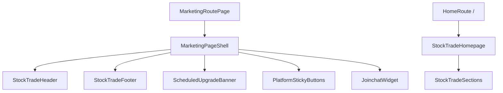

# Module: marketing/stocktrade-home

**Short:** StockTrade public marketing layout module for non-auth website pages.

**Purpose:** Provide a reusable shell, homepage composition, and navigation system for StockTrade marketing routes.

**Files:**
- `stocktrade-header.tsx` - Public navigation with desktop and mobile menus.
- `stocktrade-footer.tsx` - Public footer with marketing links and support contact.
- `stocktrade-page-shell.tsx` - Shared page wrapper for marketing pages.
- `scheduled-upgrade-banner.tsx` - Env-toggled banner for maintenance/announcement messages.
- `joinchat-widget.tsx` - Floating support widget with env-configurable text/CTA.
- `platform-sticky-buttons.tsx` - Fixed quick-access buttons linking to downloads anchors.
- `stocktrade-sections.tsx` - Homepage section components (hero, stats, highlights, payments, platforms, benefits, blog preview).
- `stocktrade-homepage.tsx` - Composes homepage sections in connected public-marketing order.
- `index.ts` - Explicit module exports.

**Flow diagram:**

**Dependencies:**
- Internal: `components/ui/popover`, `app/globals.css`
- External: none

**Env vars:**
- `SITE_BANNER_ENABLED`, `SITE_BANNER_TITLE`, `SITE_BANNER_MESSAGE`
- `CHAT_WIDGET_ENABLED`, `CHAT_WIDGET_TITLE`, `CHAT_WIDGET_MESSAGE`, `CHAT_WIDGET_CTA_LABEL`, `CHAT_WIDGET_CTA_HREF`

**Tests:** `tests/marketing/stocktrade-homepage-content.test.ts` validates content config shape and link policy.

**Change-log:** (auto-updated by Cursor on edits)
- 2026-05-13: Added StockTrade marketing shell module (header/footer/banner/chat/sticky buttons) and connected all new public marketing routes to it. Sourced from StockTrade repo.