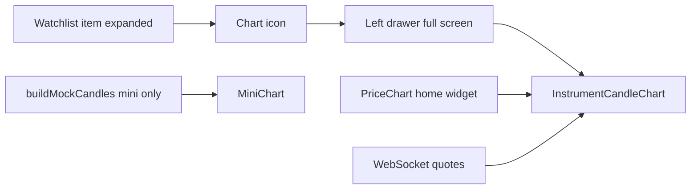

# 📊 Professional Chart Integration Guide

## 🎯 Overview
This guide will help you integrate professional, enterprise-grade charts into your trading application. We'll cover the best charting libraries, implementation strategies, and real-time data integration.

## 🏆 Top Chart Libraries for Trading Apps

### 1. **TradingView Charting Library** ⭐ **RECOMMENDED**
```bash
npm install @tradingview/charting_library
```

**Pros:**
- ✅ Industry standard for trading platforms
- ✅ Professional candlestick charts
- ✅ Built-in technical indicators (RSI, MACD, Bollinger Bands)
- ✅ Real-time data streaming
- ✅ Mobile responsive
- ✅ Advanced drawing tools

**Cons:**
- ❌ Commercial license required for production
- ❌ Large bundle size (~2MB)

### 2. **Lightweight Charts (TradingView)** ⭐ **BEST FREE OPTION**
```bash
npm install lightweight-charts
```

**Pros:**
- ✅ Free and open-source
- ✅ Extremely fast performance
- ✅ Small bundle size (~200KB)
- ✅ Perfect for candlestick charts
- ✅ Real-time updates
- ✅ TypeScript support

**Cons:**
- ❌ Limited to basic chart types
- ❌ No built-in technical indicators

### 3. **AG Charts**
```bash
npm install ag-charts-react
```

**Pros:**
- ✅ Enterprise-grade performance
- ✅ Used by 90% of Fortune 500 companies
- ✅ Canvas-based rendering
- ✅ Multiple chart types
- ✅ Real-time data support

### 4. **ApexCharts**
```bash
npm install apexcharts react-apexcharts
```

**Pros:**
- ✅ Beautiful animations
- ✅ Good React integration
- ✅ Multiple chart types
- ✅ Free for commercial use

## 🚀 Implementation Strategy

## Trading home: desktop vs mobile chart (2026-03-28)

- **`PriceChart`** (`components/trading/widgets/price-chart.tsx`) splits by breakpoint:
  - **Below `lg`:** **`MobileTradingChartPanel`** — Obsidian-**mobile** parity: symbol row (select + LTP + % vs prev close, spread placeholder), **horizontally scrollable timeframe row** (`trading-chart-timeframes.ts`, same list as desktop/Obsidian), Activity/Drawing placeholder icons, **`InstrumentCandleChart`** (`layout="card"`) with **O/H/L/C** overlay (no VOL in strip), bottom **Sell / Buy** bar when `TradingHome` passes `onQuickBuy` / `onQuickSell` (opens `OrderDialog` via `TradingDashboard`). Stock resolution: [`resolveStockForHomeChartSymbol`](components/trading/widgets/home-widget-data-utils.ts).
  - **`lg` and up:** **`DesktopTradingChartPanel`** — Obsidian-style **toolbar** (symbol, LTP, % change vs prev close when available, timeframe pills, **Candles / Line**, placeholder Indicators/Drawing/maximize/refresh) and a **taller terminal chart** with **OHLC + VOL** overlay driven by `InstrumentCandleChart` props `layout="terminal"`, `chartType`, and `onOhlcDisplay`.
- **`InstrumentCandleChart`** supports `layout: "card" | "flex" | "terminal"`, optional `chartType: "candle" | "line"` (line uses close-only series and hides volume), and optional `onOhlcDisplay` for crosshair + last-bar values.
- **Timeframe buttons** on mobile and desktop are visual state only until multi-resolution history is wired (`[SonuRamTODO]` in source).

## Watchlist full-screen chart drawer (updated 2026-03-28)

- Watchlist expanded row exposes a chart icon to open a **full-screen left drawer**.
- The drawer uses **`WatchlistObsidianChartShell`** ([`watchlist-obsidian-chart-shell.tsx`](components/trading/widgets/watchlist-obsidian-chart-shell.tsx)): Obsidian **mobile `ChartScreen` chrome** — back/close, symbol + name, LTP, % vs prev close, spread placeholder, live pill, **scrollable timeframe row**, Activity/Drawing placeholders, **O/H/L/C** overlay, then **`InstrumentCandleChart`** (`layout="flex"`).
- Shared chart engine details:
  - **Candlestick** series plus **volume** histogram (`lightweight-charts` v5).
  - **Synthetic history** seeded on open (baseline from watchlist prev-close / seed price when available).
  - **Live 1-minute bars**: LTP from `useMarketData()` via `resolveMarketWidgetLivePriceForInstrument` (token and/or `instrumentId`, matching watchlist quote resolution).
  - **Offline / no quote**: same chart keeps moving with **Obsidian-style demo ticks** (~1.5s random walk from the seeded or last close) until a live price appears.
  - **Theme**: chart grid/text/crosshair follow **light/dark** via `next-themes` + `instrument-chart-theme.ts`; the drawer shell uses semantic Tailwind (`bg-background`, etc.).
  - **Trade bar**: bottom **Sell** / **Buy** buttons call watchlist quick actions, close the chart drawer, and open **`OrderDialog`** with `initialOrderSide` for `useOrderForm`.
- The **mini sparkline** on the card still uses `buildMockCandles` + `MiniChart` for a compact line preview.



### Phase 1: Mini Charts in Watchlist (Current)
- ✅ Demo candlestick bars
- ✅ Basic price visualization
- ✅ Period selection (1D, 1W, 1M, 3M)

### Phase 2: Full Chart Integration
- 📊 Dedicated chart component
- 📈 Real-time data streaming
- 🔧 Technical indicators
- 📱 Mobile optimization

## 📋 Step-by-Step Integration

### Step 1: Install Lightweight Charts (Recommended)
```bash
npm install lightweight-charts
npm install @types/lightweight-charts  # if using TypeScript
```

### Step 2: Create Chart Component
```typescript
// components/charts/MiniChart.tsx
import { createChart, IChartApi, ISeriesApi, CandlestickData } from 'lightweight-charts';
import { useEffect, useRef } from 'react';

interface MiniChartProps {
  symbol: string;
  data: CandlestickData[];
  height?: number;
  width?: number;
}

export function MiniChart({ symbol, data, height = 100, width = 300 }: MiniChartProps) {
  const chartRef = useRef<HTMLDivElement>(null);
  const chartInstanceRef = useRef<IChartApi | null>(null);
  const seriesRef = useRef<ISeriesApi<"Candlestick"> | null>(null);

  useEffect(() => {
    if (!chartRef.current) return;

    // Create chart
    const chart = createChart(chartRef.current, {
      width: width,
      height: height,
      layout: {
        background: { color: 'transparent' },
        textColor: '#333',
      },
      grid: {
        vertLines: { visible: false },
        horzLines: { visible: false },
      },
      crosshair: {
        mode: 0,
      },
      rightPriceScale: {
        visible: false,
      },
      timeScale: {
        visible: false,
      },
    });

    // Add candlestick series
    const candlestickSeries = chart.addCandlestickSeries({
      upColor: '#26a69a',
      downColor: '#ef5350',
      borderVisible: false,
      wickUpColor: '#26a69a',
      wickDownColor: '#ef5350',
    });

    // Set data
    candlestickSeries.setData(data);

    // Store references
    chartInstanceRef.current = chart;
    seriesRef.current = candlestickSeries;

    // Cleanup
    return () => {
      chart.remove();
    };
  }, []);

  // Update data when props change
  useEffect(() => {
    if (seriesRef.current && data) {
      seriesRef.current.setData(data);
    }
  }, [data]);

  return (
    <div 
      ref={chartRef} 
      className="w-full h-full"
      style={{ height: `${height}px`, width: `${width}px` }}
    />
  );
}
```

### Step 3: Data Structure for Charts
```typescript
// types/chart.ts
export interface CandlestickData {
  time: string | number;
  open: number;
  high: number;
  low: number;
  close: number;
}

export interface ChartData {
  symbol: string;
  timeframe: '1m' | '5m' | '15m' | '1h' | '1d' | '1w' | '1M';
  data: CandlestickData[];
}
```

### Step 4: API Integration
```typescript
// lib/api/chart-data.ts
export async function fetchChartData(
  symbol: string, 
  timeframe: string = '1d',
  limit: number = 100
): Promise<CandlestickData[]> {
  try {
    const response = await fetch(
      `/api/charts/${symbol}?timeframe=${timeframe}&limit=${limit}`
    );
    const data = await response.json();
    return data;
  } catch (error) {
    console.error('Error fetching chart data:', error);
    return [];
  }
}
```

### Step 5: Real-time Data Integration
```typescript
// hooks/useRealTimeChart.ts
import { useEffect, useState } from 'react';
import { fetchChartData } from '@/lib/api/chart-data';

export function useRealTimeChart(symbol: string, timeframe: string) {
  const [chartData, setChartData] = useState<CandlestickData[]>([]);
  const [isLoading, setIsLoading] = useState(true);

  useEffect(() => {
    let intervalId: NodeJS.Timeout;
    
    const fetchData = async () => {
      try {
        const data = await fetchChartData(symbol, timeframe);
        setChartData(data);
        setIsLoading(false);
      } catch (error) {
        console.error('Error fetching real-time data:', error);
      }
    };

    // Initial fetch
    fetchData();

    // Set up real-time updates (every 5 seconds)
    intervalId = setInterval(fetchData, 5000);

    return () => {
      if (intervalId) clearInterval(intervalId);
    };
  }, [symbol, timeframe]);

  return { chartData, isLoading };
}
```

## 🔧 Advanced Features

### 1. Technical Indicators
```typescript
// For advanced indicators, consider TradingView's full library
// or implement custom calculations:

export function calculateSMA(data: number[], period: number): number[] {
  return data.map((_, index) => {
    if (index < period - 1) return 0;
    const slice = data.slice(index - period + 1, index + 1);
    return slice.reduce((sum, val) => sum + val, 0) / period;
  });
}
```

### 2. Chart Customization
```typescript
const chartOptions = {
  layout: {
    background: { color: '#ffffff' },
    textColor: '#333333',
  },
  grid: {
    vertLines: { color: '#f0f0f0' },
    horzLines: { color: '#f0f0f0' },
  },
  crosshair: {
    mode: CrosshairMode.Normal,
  },
  rightPriceScale: {
    borderColor: '#cccccc',
  },
  timeScale: {
    borderColor: '#cccccc',
    timeVisible: true,
    secondsVisible: false,
  },
};
```

### 3. Mobile Optimization
```typescript
// Responsive chart sizing
const useResponsiveChart = () => {
  const [dimensions, setDimensions] = useState({ width: 0, height: 0 });

  useEffect(() => {
    const updateDimensions = () => {
      setDimensions({
        width: window.innerWidth - 32, // Account for padding
        height: Math.min(window.innerHeight * 0.4, 300),
      });
    };

    updateDimensions();
    window.addEventListener('resize', updateDimensions);
    return () => window.removeEventListener('resize', updateDimensions);
  }, []);

  return dimensions;
};
```

## 📊 Data Sources

### 1. **Free APIs**
- **Alpha Vantage**: Free tier with 5 calls/minute
- **Yahoo Finance API**: Unofficial but reliable
- **IEX Cloud**: Free tier available

### 2. **Premium APIs**
- **Polygon.io**: Professional market data
- **Quandl**: Financial data marketplace
- **TradingView**: Real-time data feeds

### 3. **Indian Market Data**
- **NSE/BSE APIs**: Official exchange data
- **Zerodha Kite API**: Indian broker data
- **Upstox API**: Alternative Indian broker

## 🎯 Next Steps

### Immediate (Week 1-2)
1. ✅ Install Lightweight Charts
2. ✅ Create MiniChart component
3. ✅ Integrate with watchlist accordion
4. ✅ Add basic candlestick visualization

### Short-term (Week 3-4)
1. 📊 Create dedicated chart page
2. 📈 Add multiple timeframes
3. 🔧 Implement basic indicators (SMA, EMA)
4. 📱 Optimize for mobile

### Long-term (Month 2-3)
1. 🚀 Real-time data streaming
2. 📊 Advanced technical indicators
3. 🎨 Chart drawing tools
4. 💾 Historical data storage
5. 🔔 Price alerts integration

## 💡 Pro Tips

1. **Performance**: Use WebWorkers for heavy calculations
2. **Memory**: Implement data pagination for large datasets
3. **UX**: Add loading states and error handling
4. **Accessibility**: Ensure keyboard navigation support
5. **Testing**: Mock chart data for development

## 🔗 Useful Resources

- [Lightweight Charts Documentation](https://tradingview.github.io/lightweight-charts/)
- [TradingView Charting Library](https://www.tradingview.com/charting-library/)
- [Financial Data APIs Comparison](https://www.quandl.com/blog/data-providers)
- [React Chart Best Practices](https://react-charts.tanstack.com/)

---

**Ready to implement? Start with Lightweight Charts for the best balance of features and performance!** 🚀

