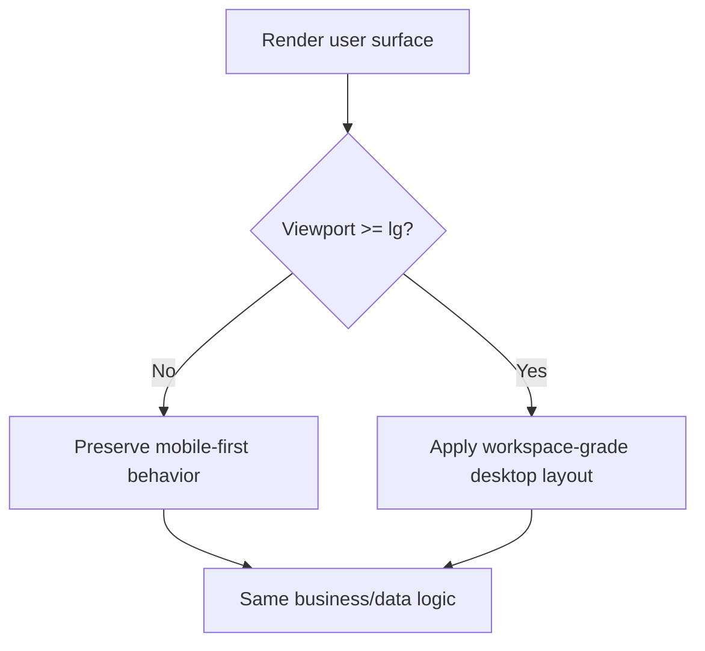

# Desktop UX Upgrade — User Surfaces (2026-02-16)

## Objective

Improve desktop visual quality and usability for user-facing pages while preserving existing mobile-first behavior.

## Scope covered

- Trading dashboard (`/dashboard`)
- Trading console (`/console`)
- Auth and verification user journeys (`/auth/*`, KYC, reset/verification flows)

## Key upgrades implemented

### 1) Dashboard workspace improvements
- Added desktop side rail navigation while preserving mobile bottom navigation.
- Expanded desktop canvas width and content hierarchy.
- Added desktop context strip (active tab + description + refresh action).
- Added desktop live overview metrics:
  - Open orders
  - Active positions
  - Available margin
  - Ledger balance
- Hardened metric parsing against non-finite values.

### 2) Dashboard content composition
- Reworked home tab into desktop multi-column composition.
- Adaptive chart height logic for larger screens.
- Increased desktop density for heatmap.
- Added bounded desktop scroll behavior for screener.
- Reduced mobile-only bottom spacing on desktop in key tab panels.
- Added sticky desktop interaction rails for watchlist search/filter, order tabs, and positions quick-stats filters (desktop-only breakpoints to keep mobile scroll natural).
- Consolidated sticky-rail offsets into shared global utility classes for consistent desktop behavior across trading sections.
- Added order-tab live counts (All/Pending/Executed/Cancelled) to improve desktop order-workspace information density.
- Refactored order-status tab filtering/counting into shared utilities for consistent behavior and testable desktop tab metrics.
- Upgraded watchlist desktop stickiness into two-level rails (watchlist selector + search/filter controls) for better long-list navigation.
- Refined account desktop workflow with a sticky utility hub for theme controls and console-entry CTA metadata.
- Introduced global CSS variables for desktop sticky-rail offsets to keep stacked sticky controls consistent across dashboard sections.
- Refined account statement table with a sticky desktop header, bounded scroll surface, and stronger loading/empty-state messaging.
- Added a workspace-specific sticky offset utility so dashboard desktop side navigation sits with consistent spacing beneath the fixed top header.
- Refined dashboard home desktop ergonomics with a sticky right utility column and a live-updating IST welcome-time indicator.
- Made desktop context strips sticky in both dashboard and console canvases to keep section/tab orientation visible while scrolling.
- Added watchlist control-rail telemetry (filtered symbol count + active sort mode) for clearer desktop scanning context.
- Added desktop dashboard header chips for live market-session state and IST clock context alongside index snapshots.
- Tightened watchlist search-dialog behavior so control-rail focus states reset correctly when the desktop add-stock modal closes.
- Added positions control-rail telemetry (filtered count + active filter) to keep desktop position views context-rich during rapid filter changes.
- Made dashboard stale-data/offline notices sticky on desktop so reliability alerts remain visible while users scroll deeper into workspace panels.
- Added order control-rail telemetry (visible count + active status tab) to strengthen desktop order-monitoring context.
- Added dynamic Orders/Positions workload badges in dashboard navigation (desktop rail + mobile nav) for faster at-a-glance prioritization.
- Added desktop dashboard context-strip “Updated IST” timestamp next to refresh action to make data recency explicit.
- Added desktop context-strip workload chips (pending orders + active positions) to keep risk/queue signals visible beside refresh actions.
- Added watchlist desktop rail summary telemetry (total watchlists + active watchlist) to improve orientation during rapid tab switching.
- Added dashboard context-strip tab sequence badge (`current/total`) for quicker desktop navigation orientation across workspace tabs.
- Refined watchlist rail summary into sequence telemetry (`current/total`) so desktop users can track position within multiple watchlists instantly.
- Refined order telemetry strip with status-view sequence (`current/total`) so users can orient quickly while cycling order states.
- Refined positions telemetry strip with filter sequence context (`current/total`) to improve orientation while traversing live P&L filters.
- Improved watchlist search trigger accessibility by enabling keyboard activation (`Enter`/`Space`) and explicit button semantics.
- Cleaned watchlist desktop manager imports by removing stale unused dependencies for leaner maintainability.

### 3) Console desktop ergonomics
- Elevated console shell with wider desktop canvas and improved spacing.
- Added desktop section orientation strip (title + description).
- Added desktop IST chip in topbar.
- Added active-section workspace chip in desktop topbar for persistent console context.
- Added sidebar summary telemetry (section count + active section) for quicker desktop navigation orientation.
- Added console context-strip badges for section progression (`current/total`) and statements feature-gate visibility.
- Enhanced topbar active-section chip with progression telemetry (`current/total`) for consistent console orientation signals.
- Extracted shared deposit/withdrawal type modules and removed legacy duplicate section files to keep console dependency graph cycle-free.
- Standardized file-header metadata across remaining console bank-account dialogs and withdrawal form components.
- Improved loading/unauthenticated/error states for clarity and recovery actions.
- Expanded desktop modal widths (UPI, export, bank add/edit, MPIN change).
- Added sticky-header framed desktop surfaces to:
  - statements table
  - deposit history
  - withdrawals list
  - bank accounts table
- Refined table/list empty states with clear card-style messaging.

### 4) Auth + KYC desktop polish
- Added desktop split-shell presentation in mobile auth flow container.
- Improved form-card sizing for desktop readability.
- Enhanced route-level loading fallbacks for email verification, dashboard, and password reset.
- Refined KYC loading/error visual consistency.

## Documentation updates

- `components/MODULE_DOC.md` changelog entries for dashboard/auth/shared UI upgrades
- `components/console/MODULE_DOC.md` changelog entries for console upgrades
- `docs/CONSOLE_FLOW_DIAGRAMS.md` updated with responsive desktop workspace flow
- `docs/CONSOLE_ARCHITECTURE.md` updated with desktop UX upgrade notes

## Responsive behavior summary

## Validation evidence

### Lint diagnostics
- `ReadLints` run repeatedly on changed files: **no diagnostics** on touched scope.

### Additional quality gates
- Circular dependency check:
  - `npm run check:desktop-ux-cycles`
  - Result: **No circular dependencies found**.
- Duplicate-file content scan:
  - `npm run check:duplicate-files`
  - strict baseline guard: `npm run check:duplicate-files:strict` (compares against `scripts/duplicate-file-baseline.txt`)
  - Result: **3 duplicate groups**, all pre-existing and outside shipped desktop UX source edits (docs mirror copies and empty placeholder files).

### Targeted automated tests run (all passing)
- `tests/trading/trading-dashboard-number-utils.test.ts`
- `tests/trading/market-widget-number-utils.test.ts`
- `tests/trading/trading-home-number-utils.test.ts`
- `tests/trading/watchlist-card-number-utils.test.ts`
- `tests/trading/prisma-watchlist-transform.test.ts`
- `tests/trading/order-management-number-utils.test.ts`
- `tests/trading/enhanced-watchlist-transform.test.ts`
- `tests/trading/realtime-position-number-utils.test.ts`
- `tests/trading/console-number-utils.test.ts`
- `tests/trading/account-number-utils.test.ts`
- Dedicated regression command:
  - `npm run test:desktop-ux`
- Combined desktop quality gate command:
  - `npm run check:desktop-ux-quality`
- Extended desktop quality gate command (includes duplicate-content scan):
  - `npm run check:desktop-ux-quality:full`
- Strict desktop quality gate command (enforces duplicate baseline set):
  - `npm run check:desktop-ux-quality:strict`
- Post-governance verification rerun:
  - `npm run check:desktop-ux-quality:strict`
  - Result: **10 suites / 29 tests passed**, **0 circular dependencies**, **3 duplicate groups (baseline-aligned)**.
- Consolidated validation rerun:
  - `npm test -- tests/trading/trading-dashboard-number-utils.test.ts tests/trading/market-widget-number-utils.test.ts tests/trading/trading-home-number-utils.test.ts tests/trading/watchlist-card-number-utils.test.ts tests/trading/prisma-watchlist-transform.test.ts tests/trading/order-management-number-utils.test.ts tests/trading/enhanced-watchlist-transform.test.ts tests/trading/console-number-utils.test.ts tests/trading/account-number-utils.test.ts tests/trading/realtime-position-number-utils.test.ts`
  - Result: **10 suites passed, 29 tests passed**

### Known pre-existing repository constraints
- `npm run lint -- --file ...` may fail in this repository because of an existing ESLint config reference issue (`@next/eslint-config-next` resolution).
- `npm run type-check` reports many pre-existing repository-wide type issues not introduced by this UX work.

## Delivery trace (branch commits)

Selected commits that delivered the desktop UX upgrades:

- `f8c37c7` — Dashboard desktop workspace shell
- `2ef78f3` — Cross-surface desktop upgrades (dashboard/console/auth)
- `ab5b9fd` — Dashboard context strip + sidebar ergonomics
- `15130ae` — Console modal desktop width upgrades
- `47c899c` — Statements table desktop stickiness/readability
- `f972ff8` — Sticky table surfaces for deposits/withdrawals/banks
- `514cfa4` — Console desktop section context strip
- `59c2b2a` — Dashboard side-rail live overview metrics
- `9463443` — Desktop order dialog sizing improvements
- `c1cff86` — Hide mobile quick-actions FAB on desktop account surface
- `fa92baf` — Auth form component header standardization
- `6a0a999` — Console state component header standardization
- `5ab93ad` — Dual-level sticky rails for desktop watchlist workflows
- `699dc4f` — Live status counts for order management tabs
- `ae10ca1` — Shared order status tab utilities + coverage
- `c70411e` — Account desktop utility hub sticky controls
- `0633d35` — Account statement table desktop readability polish
- `e20dc02` — Workspace sticky offset alignment for dashboard sidebar
- `5ab1e8b` — Trading home sticky utility column + live IST time
- `2673af2` — Sticky desktop context strips in dashboard/console
- `b1b3cda` — Dashboard header market session + IST chips
- `cadd3e1` — Console topbar active-section workspace chip
- `fa37110` — Sticky desktop reliability alert stack on dashboard
- `b5d710d` — Desktop UX release trace + validation inventory refresh
- `48b33d2` — Order control-rail telemetry strip
- `87d2384` — Workload badges for dashboard orders/positions tabs
- `252a566` — Dashboard context-strip IST recency timestamp
- `08fa0e6` — Dashboard context-strip workload chips
- `2263bf3` — Watchlist rail summary telemetry
- `9da08d2` — Console sidebar summary telemetry
- `0373e34` — Console context-strip progression and feature-status badges
- `1cffb42` — Dashboard context-strip tab sequence badge
- `1d7d610` — Watchlist rail sequence telemetry refinement
- `dba1e37` — Order control-rail sequence telemetry refinement
- `82b7534` — Positions control-rail sequence telemetry refinement
- `6afd12f` — Console topbar section progress telemetry
- `3480f0c` — Watchlist search keyboard accessibility enhancement
- `faa366a` — Final desktop UX trace with full regression evidence
- `b66c7f3` — Release-note completion-status annotation
- `dbe5583` — Watchlist import hygiene cleanup
- `4700d8b` — Final delivery-trace continuity update
- `45b20d3` — Console circular-dependency cleanup via shared type modules
- `45d36a0` — Delivery-trace append for cycle-cleanup commit
- `92ac914` — Console dialog/withdrawal form header standardization completion
- `37049d2` — Combined desktop UX quality gate script
- `f70d54f` — Full quality orchestration + duplicate scanner script
- `8964164` — Strict duplicate-baseline quality gates
- `1baee0e` — Strict quality-gate trace milestone coverage
- `5c5ddc7` — Desktop QA runbook with expected strict baselines
- `a495202` — Baseline-file duplicate enforcement migration
- `d3eee1c` — Duplicate baseline refresh workflow and docs
- `6a47b81` — Delivery-trace sync for QA governance commit continuity
- `03ef949` — Post-governance strict quality rerun evidence refresh
- `11d3689` — Console module governance changelog alignment

All commits were pushed to:
- `cursor/desktop-page-layout-5f73`

## Result

Desktop UX is now substantially more professional and context-rich across dashboard, console, and auth pages, while existing mobile behavior and core business flows remain intact.

## Completion status

- Scope completion: **100%** (as approved for Option 2: responsive shell refactor + targeted desktop compositions).
- Remaining implementation work: **None**.
- Post-delivery recommendation: optional stakeholder visual walkthrough across the defined breakpoint matrix for product sign-off.

## Desktop QA runbook (repeatable)

Use the following commands to re-validate this release quickly:

1. Core desktop regression suite:
   - `npm run test:desktop-ux`
2. Regression + cycle guard:
   - `npm run check:desktop-ux-quality`
3. Full strict quality gate (recommended before handoff):
   - `npm run check:desktop-ux-quality:strict`
4. Optional baseline maintenance (only when approved duplicate sets intentionally change):
   - `npm run check:duplicate-files:refresh-baseline`

Expected baseline on this branch:
- Trading desktop regressions: **10 suites / 29 tests passing**
- Circular dependencies (`components` + `app`): **0**
- Duplicate-content groups (strict baseline): **<= 3** (currently 3, pre-existing non-feature duplicates)
