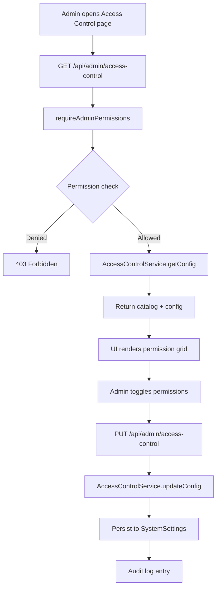
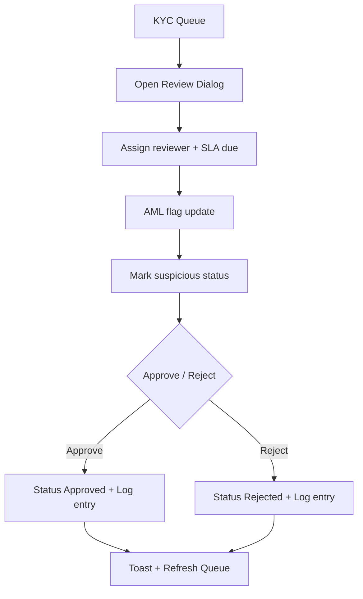
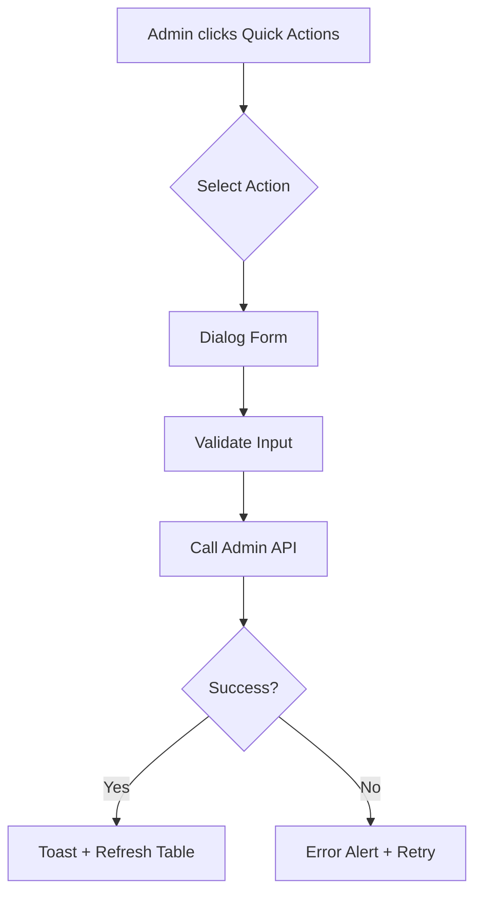

# Module: admin-console

**Short:** Admin console UI with access control management and operational workflows.

**Purpose:** Provide administrators a secure dashboard for operations, including RBAC management, user management, fund approvals, and risk monitoring. Focuses on fast operator workflows with robust error visibility.

## Key Screens
- **Dashboard:** Platform KPIs, alerts, and top traders.
- **User Management:** Search, filters, bulk actions, and per-user dialogs.
- **Fund Management:** Deposits and withdrawals review with approvals.
- **Risk Management:** Platform risk config, user limits, alerts, dynamic trading policies (multi-rule builder, including LTP-offset order templates), and the unified risk backstop (positions worker is canonical enforcer).
- **Access Control:** RBAC management UI.
- **KYC Queue:** Dedicated queue for KYC verification with SLA tracking.
- **Workers:** Background worker visibility (status/heartbeat), Redis realtime readiness, enable/disable, and run-once triggers (including risk backstop skip reasons).
- **Position Management:** Live admin position grid with server-side PnL mode verification, worker heartbeat visibility, and full/partial exit controls (quantity/lots).
- **Cleanup Management:** Manual cleanup with worker-linked automation controls (IST run window + retention days + last auto-run telemetry).
- **Orders:** Order list with filters; **Order charges** sub-tab for `order_charges_config_v1` (non-brokerage). Brokerage remains Settings → Brokerage.
- **System Health, Logs, Settings, Notifications, Financial Reports.**
- **Audit Trail:** Authentication events (`auth_events`) and platform/trading logs (`trading_logs`) with IST timestamps, summary metrics, drill-down JSON dialog, debounced search, and CSV export of the current page (`admin.audit.read`).
- **Referrals (`admin.referrals.read` / `manage`):** Program setup tab (checklist, active rule package, milestone editor, user-visible rules toggles, form create package + optional JSON import); Activity tab (relationships & bonus ledger with search, pagination, status filter, audited cancel dialog). APIs support `?search=` on attributions/rewards lists.

## User Quick Actions
Exposes existing admin APIs in the User Management table:
- Reset password: `POST /api/admin/users/{userId}/reset-password`
- Reset MPIN: `POST /api/admin/users/{userId}/reset-mpin`
- Freeze/unfreeze account (suspension only): `POST /api/admin/users/{userId}/freeze`
- Verify contact (email/phone): `POST /api/admin/users/{userId}/verify-contact`
- Assign/unassign RM: `PATCH /api/admin/users/{userId}/assign-rm`
- Risk limits override: `GET/PUT /api/admin/users/{userId}/risk-limit`

## Data Source Clarity
- Live/Partial/Error/Sample statuses surfaced on Dashboard, User Management, and Fund Management.
- Sample data is manual-only and never auto-selected.
- Error alerts include reasons for each failing endpoint.

## KYC & Compliance Ops
- Dedicated queue: `GET /api/admin/kyc` → `/admin-console/kyc`
- Assignment & SLA tracking: `PATCH /api/admin/kyc`
- AML flags + suspicious review status (clear/review/escalated)
- Review logs stored in `kyc_review_logs`
- Document viewer for bank proof URL
- Filters include AML flag match and SLA buckets (24h/48h/72h)

## Files
- `header.tsx` — loads admin session, role, and permissions
- `sidebar.tsx` — navigation gated by permissions
- `access-control.tsx` — RBAC management UI
- `risk-management.tsx` — risk limits/config + alerts + thresholds + dynamic policies + run-now backstop
- `workers.tsx` — worker cards (health, enable/disable, run once, config inputs)
- `positions-management.tsx` — live admin positions table, server-side PnL status, and robust close dialog (full/partial exits)
- `kyc-queue/` — modular KYC queue (root, toolbar, metrics, table, compliance dialog, Applicant CRM drawer)
- `app/(admin)/admin-console/kyc/page.tsx` — KYC queue entry
- `app/(admin)/admin-console/access-control/page.tsx` — access control page entry
- `app/(admin)/admin-console/workers/page.tsx` — workers page entry
- `app/api/admin/access-control/route.ts` — RBAC config API
- `app/api/admin/kyc/route.ts` — KYC queue + review actions API
- `app/api/admin/kyc/[kycId]/route.ts` — KYC detail + review logs API
- `app/api/admin/workers/route.ts` — worker status + manage API (no CRON secrets in browser)
- `app/api/admin/positions/route.ts` — list/manage/create positions with server-side PnL settings metadata
- `app/api/admin/risk/thresholds/route.ts` — read/update canonical risk thresholds (SystemSettings)
- `app/api/admin/risk/policies/route.ts` — dynamic admin trading policy CRUD + catalog (SystemSettings)
- `app/api/admin/risk/monitor/route.ts` — run risk backstop (skips if positions worker healthy unless force-run)
- `app/api/admin/cleanup/automation/route.ts` — read/update cleanup automation controls for worker-linked scheduled purge
- `lib/server/workers/registry.ts` — worker registry + health rules + SystemSettings keys
- `lib/admin/kyc-utils.ts` — SLA and AML flag utilities
- `lib/services/admin/AccessControlService.ts` — RBAC config persistence
- `audit-trail.tsx` — audit UI (auth vs trading tabs, filters, summary strip, detail dialog, export)
- `lib/services/admin/audit-trail.service.ts` — list auth events + trading logs, metadata IP/UA parsing, summary counts
- `lib/admin/audit-trail-filter-options.ts` — client-safe enum option lists for filters
- `app/api/admin/audit/route.ts` — `GET` audit listing + optional `summary`
- `app/(admin)/admin-console/audit/page.tsx` — audit page shell
- `lib/admin/synthetic-system-health-snapshot.ts` — deterministic observability-shaped synthetic payload (meta, correlation IDs, traffic percentiles, runtime, signals, dependencies, DB internals, service semver/ready/p99) for System Health; Prisma merge in route
- `MODULE_DOC.md` — this file

## Flow Diagrams

### RBAC Management

### KYC Review Flow

### Quick Action Flow

## Dependencies
- `lib/rbac` for permission catalog and guard
- `lib/services/admin/AccessControlService`
- `@/auth` for session resolution
- `AdminSessionProvider` for reactive role/permission state across admin console UI

## APIs
- `GET /api/admin/access-control` — fetch role permissions and catalog
- `PUT /api/admin/access-control` — update role permissions
- `GET /api/admin/kyc` — list KYC queue with filters
- `PATCH /api/admin/kyc` — update assignment/SLA/AML/suspicious
- `PUT /api/admin/kyc` — approve/reject KYC
- `GET /api/admin/kyc/{kycId}` — fetch KYC detail + logs
- `GET /api/admin/me` — session user + permissions for UI gating
- `GET/PUT /api/admin/users/{userId}/statement-override` — per-user statements tri-state override (default/force_enable/force_disable)
- `GET /api/admin/workers` — list workers with enabled + heartbeat health
- `POST /api/admin/workers` — toggle enabled, run once, set PnL mode
- `GET/PATCH/POST /api/admin/positions` — live positions listing with PnL mode metadata, robust edit/create, and full/partial exits
- `GET/PUT /api/admin/risk/thresholds` — read/update canonical thresholds in SystemSettings
- `GET/POST/PUT/DELETE /api/admin/risk/policies` — dynamic admin-defined trading policy CRUD and catalog in SystemSettings
- `GET/POST /api/admin/risk/monitor` — risk backstop endpoint (positions worker is canonical enforcer)
- `GET/POST /api/admin/cleanup/automation` — cleanup automation controls for worker-linked daily purge
- `GET /api/admin/audit` — paginated audit trail (`source=auth|trading`, `search`, `severity`, `status`, `action` for auth; `category`, `level`, `clientId`, `userId`, date range for trading; `summary=true` for 24h/7d headline counts). **RBAC:** `admin.audit.read`. **Service:** `AuditTrailService`.

## Env vars
None.

## Tests
- `tests/admin/access-control-guard.test.ts`
- `tests/admin/audit-trail.service.test.ts` — audit status buckets, metadata parsing, invalid auth action guard
- `tests/order/order-charges-compute.test.ts`

## Changelog
- 2026-04-03 (IST): **Referrals admin UX** — `components/admin-console/referrals/*`: Program setup vs Activity tabs; checklist + plain-language copy; form-based new rule packages; JSON under Advanced; ledger pagination/search/cancel dialog. APIs: `?search=` on referral attributions/rewards lists.
- 2026-04-03 (IST): **Trading-dashboard presence** — See `components/admin-console/MODULE_DOC.md` (shared enrichers, admin SSE `/api/admin/presence/stream`, RM parity on users list, KYC + picker + dashboard surfaces). **TradeBazaar** parity.
- 2026-04-01 (IST): **User suspension vs deactivation vs eligibility tag** — Prisma `users.suspended_at` / `suspension_reason` / `suspended_by_id`; freeze API sets suspension only (not `isActive`); deactivate invalidates sessions; auth gates + JWT `accountBlocked` strip; user list shows Suspended / Deactivated / Policy low-activity badge; filters `deactivated` & `suspended`; active headcount base adds `suspendedAt: null`.
- 2026-03-27 (IST): **Orders → Order charges** — parity with TradeBazaar (`lib/order-charges/*`, `MarginCalculator`, admin Orders tab, `GET /api/risk/order-charges-config`).
- 2026-03-25 (IST): **System Health** observability UI — API returns `meta`, `correlation`, `traffic`, `runtime`, `signals`, `dependencies`, extended `database` (WAL lag, buffer hit, tx/s, idle-in-txn), metrics `subtitle`, services `version`/`ready`/`p99Ms`; route sets `meta.observedAt`, `traffic.edgeDbProbeMs`, and raises `traffic.p99Ms` / DB service p99 from real Prisma ping when online. `system-health.tsx`: telemetry strip + copy correlation, traffic + runtime KPI grid, Recharts sparklines (last 24 poll samples), signals + dependencies columns, IST formatting, 15s poll.
- 2026-03-20 (IST): **System Health** — `GET /api/admin/system/health` uses `buildSyntheticSystemHealthSnapshot` (`lib/admin/synthetic-system-health-snapshot.ts`): smooth time-based metric variation (no `Math.random`), correlated memory vs CPU, rare API latency blips and periodic cache ONLINE/DEGRADED; Prisma ping still sets Database latency/status. JSON adds `database` (PostgreSQL label, synthetic moving connection count, `OFFLINE` + 0 connections when DB down). `system-health.tsx` polls every 18s, shows header **Updated** clock, wires DB strip from API; removed `console.log`.
- 2026-03-20 (IST): **Audit Trail** overhaul: dual tabs (authentication vs platform/trading), `AuditTrailService` + extended `GET /api/admin/audit` (`source`, fixed `status`/`action` filters, `summary=true`), IP/UA from `AuthEvent.metadata` + `TradingLog.metadata`, summary metrics strip, row detail dialog with JSON copy, debounced search, CSV export for current page; client filter options in `lib/admin/audit-trail-filter-options.ts`.
- 2026-03-20 (IST): Admin **sidebar** uses a column flex layout: navigation scrolls with a thin **primary-tinted** scrollbar (`.scrollbar-admin-nav` in `globals.css`); **System Status** / DB card sits in a non-overlay footer so **Settings**, **Logs**, and other lower links stay visible and tappable.
- 2026-03-20 (IST): **Audit Trail** no longer crashes when `AuthEvent.userId` is null: `audit-trail.tsx` uses safe ID previews; `GET /api/admin/audit` returns explicit `null` IDs and **System** user label when no user row. **StatusBadge** coerces null/empty severity to `UNKNOWN`. **Advanced Analytics** shows a destructive alert + toast on failed `/api/admin/analytics` (no silent all-zeros), and an informational “no activity in this range” hint when metrics are legitimately zero.
- 2026-03-20 (IST): Financial overview super-admin page adds **Withdrawals** audit tab (`/api/super-admin/withdrawals/audit`, `WithdrawalAuditService`) beside deposits; withdrawal reject API passes `actorRole` into fund logs for audit role column.
- 2026-03-09 (IST): Sidebar top logo replaced with header logo (`BRAND_ASSETS.logos.headerLogo`); shown when expanded and as small icon when collapsed.
- 2026-03-09 (IST): Stored statement text (transaction descriptions) upgraded across admin fund flows: deposit/withdrawal approval and admin credit/debit in `AdminFundService`, manual balance/margin adjustment in `AdminUserService`, and position value adjustment in `/api/admin/positions` now write detailed descriptions (amount, refs, admin name) for clear user statements.
- 2026-02-24 (IST): Workers page now includes live server market-data probe diagnostics from `/api/admin/market-data-health` (feed connected/disconnected, message age, cache/subscription counts, probe status) and order-worker heartbeat feed metrics (`deferredDueToStaleQuote`, feed connectivity fields) for direct operations visibility when MARKET orders are delayed/cancelled by quote freshness.
- 2026-02-17 (IST): Settings > Home Tab is now canonical for `/dashboard` Home defaults (ticker marquee symbols, default chart symbol, and supported widget visibility), aligned with normalized config schema consumed by the merged home-config API.
- 2026-02-17 (IST): Added Settings > General active-user eligibility controls (`balance < X` + `no trading for Y days`) and wired active-user counts in stats/analytics/reports to exclude users matching this inactivity policy.
- 2026-02-17 (IST): Enhanced Cleanup Management with automation controls (enable, retention days, IST daily run hour) and last auto-run telemetry backed by `/api/admin/cleanup/automation`.
- 2026-02-17 (IST): Rebuilt Risk Management > Policies dialog into a guided Policy Engineering Studio (blueprint-based authoring, auto-compiled condition matrix preview, and no raw condition editing) so non-technical admins can create advanced policies safely while retaining enterprise/complex visual depth.
- 2026-02-17 (IST): Enhanced Risk Management > Policies with quick templates for segment-scoped LTP-offset execution controls (BUY above LTP %, SELL below LTP %), enabling admins to enforce side-aware order pricing constraints directly from policy UI.
- 2026-02-17 (IST): Upgraded Admin Position Management to verify server-side PnL mode + worker heartbeat in the UI, added resilient live-refresh controls (SSE + interval), fixed signed quantity rendering for short positions, and introduced robust full/partial admin exit flow (quantity/lots with optional exit price).
- 2026-02-17 (IST): Upgraded Risk Management > Policies tab to a dynamic multi-policy builder (context, priority, ALL/ANY matching, condition rows, block messages, enable/disable toggles) wired to CRUD APIs for robust admin rule management.
- 2026-01-15 (IST): Added user quick actions for admin APIs and data source status messaging on core admin pages.
- 2026-01-15 (IST): Added KYC queue with assignment, SLA tracking, AML flags, and review logs.
- 2026-01-15 (IST): Added AML flag filter and extended SLA buckets in KYC queue.
- 2026-01-15 (IST): Added RBAC access-control UI, restricted permission gating, and audit logging.
- 2026-01-25 (IST): Hardened Access Control reliability via `AdminSessionProvider` (reactive permissions), improved `/api/admin/me` error handling/logging, and added RBAC audit diffs.
- 2026-01-25 (IST): Added professional mini scrollbar to admin console sidebar.
- 2026-02-03 (IST): Added app-wide statements toggle in Settings + per-user statements override (tri-state) in Edit User dialog; statement exports blocked when disabled.
- 2026-02-04 (IST): Added Workers page to manage background workers (heartbeats, enable/disable toggles, and run-once triggers) via `/api/admin/workers`.
- 2026-02-13 (IST): Enhanced Workers page to show Redis realtime bus state + detailed heartbeat stats (scanned/updated/errors/elapsed) for faster ops debugging of worker→dashboard updates.
- 2026-02-13 (IST): Updated Risk Management tab to edit canonical risk thresholds (SystemSettings) and run unified risk backstop (skips when positions worker is healthy unless force-run).
- 2026-02-16 (IST): Fixed middleware behavior for admin-console fetches so `/api/admin/*` and other protected APIs return JSON `401/403` instead of `307` redirects to login pages.
- 2026-02-16 (IST): Hardened KYC document review by resolving private `bankProofKey` values to fresh presigned URLs in admin APIs and improving KYC dialog fallbacks for expired/missing document links.
- 2026-02-16 (IST): Refined KYC review dialog into a wide landscape layout with dedicated internal scrolling and cleaner section alignment for reliable operator usability on long records.
- 2026-02-16 (IST): Added app-wide `kyc_enforcement_enabled` toggle in Settings > General to let admins bypass KYC redirects/trading KYC blocks while keeping phone verification and mPin gates active.
- 2026-02-17 (IST): Added Risk Management > Policies tab with admin-configurable negative-PnL close-delay rule and wired it to `/api/admin/risk/policies` for platform policy control.
