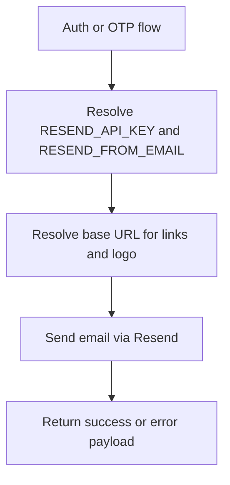

# Module: lib

**Short:** Shared application libraries and cross-cutting utilities.

**Purpose:** Provide reusable helpers for runtime configuration, integrations, and business-support utilities used by multiple modules.

**Key files for this change:**
- `ResendMail.ts` - Transactional email sender helpers (verification, password reset, OTP).
- `config/runtime.ts` - Runtime environment parsing/validation utilities.
- `marketing/marketpulse-homepage-content.ts` - Centralized MarketPulse marketing copy/routes for public marketing routes.
- `branding-routes.ts` - Canonical route helper layer for branding-driven slug resolution, rewrites, and redirects.

**Email flow diagram:**

**Dependencies:**
- External: `resend`, `zod`
- Internal: `actions/*`, `lib/otp-service.ts`

**Env vars:**
- `RESEND_API_KEY` - Resend API key for outbound notifications.
- `RESEND_FROM_EMAIL` - Sender email used for transactional notifications.
- `NEXT_PUBLIC_BASE_URL` / `NEXTAUTH_URL` - Base URL used to construct email links and logo URL.

**Change-log:** (auto-updated by Cursor on edits)
- 2026-04-04: Maintenance: `lib/maintenance.ts` `applyMaintenanceModeEnvOverride()` — literal `MAINTENANCE_MODE=true|false` overrides DB `isEnabled`; cache holds base config. `lib/server/maintenance.ts` reads global `MAINTENANCE` settings (`ownerId: null`, `orderBy updatedAt desc`).
- 2026-04-03: Maintenance RBAC helper `lib/maintenance-rbac.ts` (`canManageMaintenanceSettings`); maintenance toggle/status/config API routes use `baseLogger` (pino) instead of `console.*`; public maintenance page reads live copy from GET `/api/maintenance/status`.
- 2026-02-27: Order-form stock normalization now strips non-positive strike values (e.g. futures `strikePrice: 0`) so non-option orders do not emit invalid derivative identity payloads.
- 2026-02-27: Added strict display snapshot resolver (`resolveDisplayQuoteSnapshot`) to enforce <=60s UI visibility semantics and introduced market-data provider quote warm-up API (`warmupQuote`) that resubscribes + bounded-waits for fresh ticks and falls back to `/api/quotes` before client actions.
- 2026-02-27: Smoothness-first realtime hardening: websocket market-data path now debug-gates high-frequency logs, emits quote deltas instead of full-cache payloads per tick, shared SSE manager now proactively emits `connected` to subscribers and can re-establish closed streams on online/visibility probes, and realtime order/position/account hooks trigger immediate revalidate on reconnect.
- 2026-02-26: Relaxed client quote rendering to match sparse-tick feeds: UI now retains and displays last received quote (no false “stale”), quote snapshots expose `isDisplayable` (default 60s), websocket hook retains quotes on disconnect/error, and market-data provider performs 60s idle resubscribe only while market session is open.
- 2026-02-25: Exchange-aware market-data subscriptions: server-side cache/worker warmup now supports subscription keys like `NSE_FO-<token>` while still caching quotes by numeric `instrumentToken`. Token-scoped subscription errors are tracked separately (no feed disconnect) and surfaced via `/api/admin/market-data-health` for operations visibility.
- 2026-02-25: Strict live-only client pricing: disabled default jitter/interpolation in websocket provider, cleared quote cache on disconnect/error, and added on-demand order-token subscription so fresh quotes arrive before MARKET actions are enabled.
- 2026-02-24: Added a canonical quote snapshot resolver in `lib/market-data/utils/quote-lookup.ts` (`uiPrice`, `tradePrice`, freshness, source, timestamp age) and aligned order-form + realtime-order cache patching to preserve submitted vs executed price semantics during SSE lifecycle updates.
- 2026-02-24: use-order-form: removed client-side hard block on stale quote for MARKET orders; server is sole authority; client sends best-available price and ltpTimestamp/ltpSource/ltpAgeMs; hook now exposes quoteFreshness for order-panel UX. Dashboard index display uses isQuoteFresh(5s) so header and connection state stay aligned.
- 2026-02-24: Hardened server market-data connectivity primitives by adding `waitForFreshQuote(...)`, richer feed health snapshot fields (message/error ages + wanted/subscribed token counts), and runtime warnings for demo/default API-key usage outside tests.
- 2026-02-24: Hardened live market-data path end-to-end: `use-order-form` now submits MARKET orders from live quote stream with timestamp/age metadata, order API validation accepts quote metadata fields, websocket provider batches token subscriptions, and unresolved watchlist instruments are explicitly surfaced for live-feed troubleshooting.
- 2026-02-23: Added worker-health gated order pricing in `lib/services/order/OrderExecutionService.ts` (server-side quote/cache/price-resolver path when `order_execution` is healthy, strict client fallback only when unavailable), plus realtime quote utility enhancements (`resolveSubscriptionToken`, `isQuoteFresh`) for reliable token fallback and staleness checks.
- 2026-02-23: Added default watchlist bootstrapping in registration paths (`lib/database-transactions.ts` and `actions/auth.actions.ts`) so every newly created user starts with a single default `My Watchlist`.
- 2026-02-23: Removed registration-time sample order/position seeding from both web signup (`actions/auth.actions.ts`) and mobile signup transaction helper (`lib/database-transactions.ts`) so new accounts start with empty books.
- 2026-02-22: Relaxed watchlist add-item numeric null handling in API by normalizing optional numeric `null` values to omitted fields before schema parsing, preserving strict validation for malformed numeric inputs.
- 2026-02-22: Updated watchlist add hook + API normalization to treat duplicate token adds as non-fatal UX feedback and to canonicalize persisted exchange/segment metadata (equity vs F&O vs MCX) for consistent watchlist rendering/live subscriptions.
- 2026-02-22: Strengthened watchlist add API and search token mapping by normalizing alternate token keys in instrument search responses and returning deterministic 400 responses when token extraction fails for add-item requests.
- 2026-02-21: Removed duplicate OTP branch during registration phone verification (`PHONE_VERIFICATION` now directly unlocks mPin setup for new users), and fixed websocket hook connection-state ordering to prevent stale loading/connecting flags from blocking dashboard header readiness.
- 2026-02-20: Updated `lib/marketing/marketpulse-homepage-content.ts` to source homepage text labels from `Branding/marketing.ts` while keeping route href construction in lib helpers.
- 2026-02-20: Added `lib/branding-routes.ts` as the typed route source-of-truth consumed by middleware/UI/actions, including current->internal rewrite mapping and legacy->current redirect mapping for branding slug migrations.
- 2026-02-20: Centralized runtime branding in `Branding/*` and refactored runtime integrations (`ResendMail.ts`, `aws-sns.ts`, quote URL fallbacks, watchlist default colors) to consume branding helpers/tokens instead of hardcoded literals.
- 2026-02-19: Added `lib/marketing/marketpulse-homepage-content.ts` and corresponding tests to centralize MarketPulse marketing copy, links, and section metadata used by new public marketing pages.
- 2026-02-17: Updated `withCreateWatchlistTransaction` to auto-mark first watchlist as default while preserving explicit default behavior for subsequent watchlists.
- 2026-02-16: Updated `ResendMail.ts` to use TradeBazaar branding/logo and env-driven sender (`RESEND_FROM_EMAIL`) with default `noreply@tradebazar.live`.
- 2026-02-16: Renamed marketing content config to `tradebazaar-homepage-content.ts` and updated OTP/message branding references to TradeBazaar + `tradebazar.live`.
- 2026-02-16: Added shared KYC helpers for private S3 document key validation/resolution (`kyc-document.ts`) and deterministic auth KYC-state messaging (`auth/kyc-gating.ts`) used by login/middleware/admin APIs.
- 2026-02-16: Added KYC enforcement runtime helpers (`server/kyc-enforcement.ts`, `kyc-enforcement.ts`) plus `/api/kyc/config` integration for secure-by-default KYC toggle resolution with short TTL caching.
- 2026-02-16: Hardened OTP delivery metadata in `otp-service.ts` to always attempt email when available and return precise `emailAttempted`/`emailEnqueued`/`emailError` fields for downstream UI handling.
