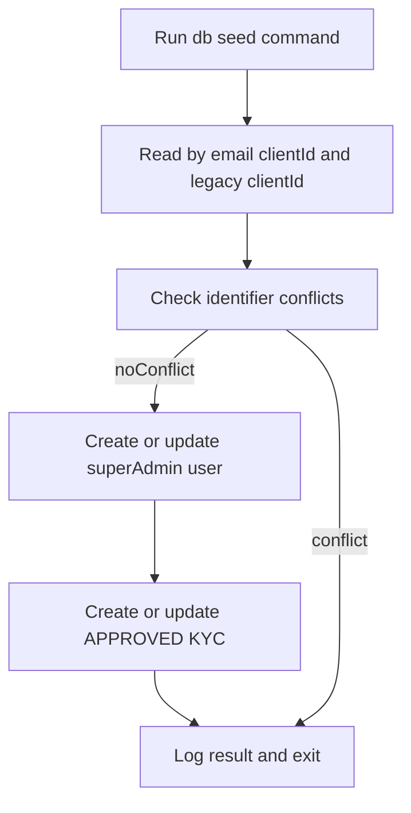

# Module: scripts

**Short:** Operational scripts for local and production-safe maintenance tasks.

**Purpose:** Keep one-off or repeatable automation tasks (seeding, admin bootstrap, diagnostics) centralized and documented.

**Files:**
- `create-admin-user.ts` - Creates default admin/moderator bootstrap users.
- `seed-super-admin.ts` - Idempotently creates/updates the platform super-admin account (aligned with TradeBazaar bootstrap credentials).
- `check-branding-literals.py` - Fails when legacy brand and route literals are found outside allowed branding/route modules.

**Flow diagram:**

**Dependencies:**
- Internal: Prisma schema models (`User`, `Role`)
- External: `@prisma/client`, `bcryptjs`, `pino`, `tsx`

**APIs:** none.

**Env vars:**
- `DATABASE_URL` - Required for Prisma DB connectivity.
- `DIRECT_URL` - Required for direct Prisma operations in configured environments.
- `LOG_LEVEL` - Optional log-level override for script runs.

**Tests:** `tests/scripts/seed-super-admin.test.ts` plus manual execution/DB verification for end-to-end seed reruns.

**Change-log:** (auto-updated by Cursor on edits)
- 2026-03-29 (IST): `deploy/nginx-site-tradingpro.sh` — EC2 nginx + certbot for `marketpulse360.live` → port `4000`, isolated from TradeBazaar vhost.
- 2026-03-29 (IST): Root `ecosystem.config.cjs` — PM2 `tpro-*` processes, Next `4000`, terminal-gateway `4001`, for same-EC2 deploy as TradeBazaar; see `docs/deployment/ec2-pm2-nginx.md`.
- 2026-03-28 (IST): `seed-super-admin.ts` — login clientId/name `TradeBazaar`, bcrypt `mPin` on create/update, legacy `Tradebazar` clientId merge, optional `SUPER_ADMIN_BOOTSTRAP_PASSWORD` / `SUPER_ADMIN_BOOTSTRAP_MPIN`; npm script `db:seed:super-admin`.
- 2026-02-20: Extended `check-branding-literals.py` to flag hardcoded legacy route slugs (auth/dashboard/why-us/admin-console/products/payment) outside `Branding/*` and `lib/branding-routes.ts`.
- 2026-02-20: Added `check-branding-literals.py` and `npm run check:branding` guardrail for literal-brand drift, and updated admin bootstrap script emails to derive domain from `Branding/identity.ts`.
- 2026-02-16: Added `seed-super-admin.ts` and documented `db:seed:super-admin` bootstrap flow for TradeBazaar SUPER_ADMIN provisioning.
- 2026-02-16: Hardened `seed-super-admin.ts` to enforce OTP-off (`requireOtpOnLogin: false`), verified-contact state (`emailVerified` + `phoneVerified`), and idempotent APPROVED KYC upsert for the configured seed identity on every rerun.
